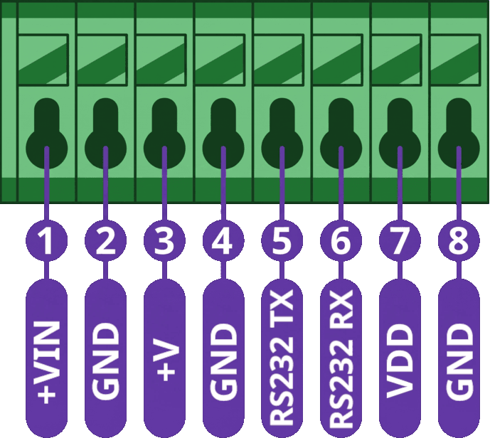
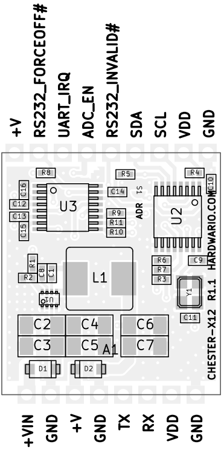

import Image from '@theme/IdealImage';

# CHESTER-X12 {#chester-x12}

**CHESTER-X12** je rozšiřující modul platformy CHESTER pro sériovou komunikaci **RS-232**.

<Image img={require('../../../../../chester/extension-modules/images/chester-x12-top.png')} alt="Pohled na červenou desku CHESTER-X12 shora s převodníkem I²C na UART SC16IS740IPW, transceiverem RS-232 MAX3226, tlumivkou snižujícího měniče, krystalem a pájecí propojkou adresy ADR"/>

## Přehled modulu {#module-overview}

Modul CHESTER-X12 přidává sériové rozhraní **RS-232**. Převodník I²C na UART **SC16IS740IPW** se připojuje k základní desce CHESTER po **I²C** a transceiver **MAX3226EEUE+** převádí signály UART na plnohodnotné úrovně RS-232 s ochranou proti ESD ±15 kV. Vysílací a přijímací linka RS-232 jsou vyvedené na svorkovnici.

Modul může běžet přímo ze základní desky CHESTER. Případně lze na **+VIN** připojit externí linku **5–28 V DC**, která napájí snižující měnič **TPS62933** na desce; jeho pevný výstup **5 V** (**+V**) pak napájí základní desku CHESTER. Vstup chrání Schottkyho diody (**PMEG6010ELR**). Vstupní napětí sleduje převodník ADC **TLA2021** na desce, čtený po I²C.

## Klíčové vlastnosti {#key-features}

* **Rozhraní RS-232:** Plně duplexní sériová linka s plnohodnotnými úrovněmi RS-232 a ochranou proti ESD ±15 kV na vývodech I/O (MAX3226EEUE+).
* **Převodník I²C na UART:** SC16IS740IPW připojuje UART pro RS-232 ke sběrnici I²C základní desky CHESTER.
* **Flexibilní napájení:** Běží ze základní desky CHESTER, nebo z volitelné linky 5–28 V DC na +VIN přes snižující měnič na desce (TPS62933).
* **Ochrana vstupu:** Schottkyho diody (PMEG6010ELR) na napájecím vstupu.
* **Monitorování vstupního napětí:** Převodník ADC na I²C (TLA2021) na desce měří vstupní napětí.
* **Řízení spotřeby:** Transceiver RS-232 lze signálem FORCEOFF# vypnout a snížit tak spotřebu.

## Typické aplikace {#typical-applications}

* **Průmyslové senzory:** Připojení senzorů a řídicích jednotek přes platformu CHESTER.
* **Starší zařízení:** Integrace s existujícími zařízeními RS-232.
* **Automatizace budov:** Systémy HVAC, řízení osvětlení a měření spotřeby.
* **Komerční využití:** Terminály POS a čtečky čárových kódů.
* **Pomocné nástroje:** Přístup k sériové konzoli a připojení laboratorních přístrojů.

## Technické parametry {#technical-specifications}

| Parametr | Hodnota |
| :--- | :--- |
| **Typ rozhraní** | RS-232 |
| **Protokol** | Plně duplexní asynchronní sériová linka |
| **Přenosová rychlost** | Až 250 kb/s (omezení transceiveru) / 3 Mb/s (omezení převodníku) |
| **Datové bity** | 5, 6, 7, 8 |
| **Stop bity** | 1; 1,5; 2 |
| **Parita** | Žádná, sudá, lichá, mark, space |
| **Řízení toku** | Softwarové (XON/XOFF) |
| **Rozhraní k hostu** | I²C |
| **Napájecí vstup (+VIN)** | 5–28 V DC (volitelné externí napájení) |
| **Napájecí výstup (+V)** | Pevných 5 V, napájí základní desku CHESTER |
| **Monitorování napětí** | 12bitový ADC na I²C (TLA2021) na desce, měří vstupní napětí |
| **Rozhraní desky** | Půlené prokovené otvory (castellated) na dvou protilehlých hranách, deska je připájená k základní desce CHESTER |
| **Revize hardwaru** | R1.2 |

## Klíčové součástky {#key-components}

| Součástka | Typové označení | Popis |
| :--- | :--- | :--- |
| **Převodník I²C na UART** | SC16IS740IPW | Jeden UART s rozhraním I²C, 64bajtová FIFO |
| **Transceiver RS-232** | MAX3226EEUE+ | Skutečné úrovně RS-232, ochrana proti ESD ±15 kV |
| **ADC pro monitorování napětí** | TLA2021 | 12bitový ADC na I²C (adresa 0x49); měří vstupní napětí |
| **Měnič DC-DC** | TPS62933 | Snižující měnič, vstup 5–28 V DC, výstup 5 V |
| **Ochrana vstupu** | PMEG6010ELR | Schottkyho diody pro ochranu vstupu |

## Zapojení pinů {#pin-configuration}

Modul používá standardizované rozvržení konektoru kompatibilní se slotem pro rozšiřující moduly CHESTER.

:::note
Zobrazené zapojení pinů platí pro základní desku CHESTER-M CGLS.
:::

### Zapojení konektoru CHESTER-X12 {#chester-x12-connector-pinout}

| Pin | Signál | Typ | Popis |
| :---: | :--- | :--- | :--- |
| 1 | +VIN | Napájecí vstup | Volitelný externí stejnosměrný vstup do snižujícího měniče na desce (5–28 V DC) |
| 2 | GND | Zem | Systémová zem |
| 3 | +V | Napájecí výstup | Pevných 5 V ze snižujícího měniče na desce (napájí základní desku CHESTER) |
| 4 | GND | Zem | Systémová zem |
| 5 | RS232 TX | RS-232 | Vysílaná data RS-232 (výstup modulu) |
| 6 | RS232 RX | RS-232 | Přijímaná data RS-232 (vstup modulu) |
| 7 | VDD | Napájení | Napájení logiky 3,3 V ze základní desky CHESTER |
| 8 | GND | Zem | Systémová zem |

:::info
Modul může běžet přímo ze základní desky CHESTER. Když je na **+VIN** (pin 1) připojené externí napájení **5–28 V DC**, vytváří snižující měnič TPS62933 na desce pevných **5 V** na **+V** (pin 3), kterými se napájí základní deska CHESTER.
:::

:::warning Nutná úprava ochrany proti ESD
Transceiver RS-232 používá záporné napěťové úrovně. Zařízení CHESTER musí mít upravenou ochranu proti ESD na vstupech pro signály **A3** a **A4** na **slotu A**, případně **B3** a **B4** na **slotu B**. Standardní jednosměrné diody TVS (**SMA6J28A**) je nutné nahradit obousměrnými (**SMA6J28CA**). Pokud ochranu proti ESD nepotřebujete, lze tyto diody odstranit.

:::

### Rozhraní k hostu (I²C) {#host-interface-ic}

Modul CHESTER-X12 komunikuje se základní deskou CHESTER po standardní sběrnici **I²C**. Na sběrnici jsou dvě zařízení: převodník UART **SC16IS740IPW** a převodník ADC **TLA2021** pro monitorování napětí.

Adresa převodníku UART se volí pájecí propojkou **S1** na desce (na potisku **ADR**): **0x54** ve **slotu A** a **0x55** ve **slotu B**. Když se modul dodává jako součást kompletní jednotky CHESTER, je tato adresa nastavená ve výrobě; u samostatného modulu si ji musí nastavit uživatel. Převodník ADC TLA2021 má adresu **0x49**.

Kromě SDA/SCL používá modul piny GP slotu:

| Pin CHESTER-X | Signál | Zdroj / funkce |
| :--- | :--- | :--- |
| GP0 / A0 | INVALID# | MAX3226EEUE+. Indikace platné úrovně na přijímači RS-232 |
| GP1 / A1 | ADC_EN | Zapíná měření vstupního napětí čipem TLA2021 |
| GP2 / A2 | IRQ | Přerušení UART čipu SC16IS740IPW |
| GP3 / A3 | FORCEOFF# | Vypnutí MAX3226EEUE+ (úsporný režim) |

Vstup FORCEON transceiveru je trvale ve vysoké úrovni, takže firmware může transceiver RS-232 aktivací signálu **FORCEOFF#** (GP3/A3) vypnout do úsporného stavu.

## Připojení RS-232 {#rs-232-connection}

Sériové zařízení zapojte do svorkovnice: **RS232 TX** (pin 5), **RS232 RX** (pin 6) a společnou zem **GND** (pin 2, 4 nebo 8). Vyvedené jsou pouze datové linky pro vysílání a příjem; linky hardwarového řízení toku (RTS/CTS) konektor nemá.

Rozhraní RS-232 **není galvanicky oddělené**, takže sériové zařízení a zařízení CHESTER musí mít společnou zem.

### Průchod krabičkou {#enclosure-feed-through}

Sériový kabel lze do krabičky přivést dvěma způsoby:

- **Kabelová vývodka (výchozí):** vodiče RS-232 protáhnete vývodkou ve stěně krabičky a zapojíte do svorkovnice.
- **Panelový konektor (na vyžádání):** uživatel sériový kabel jen zapojí do konektoru ve stěně krabičky a uvnitř nezůstane žádná volná kabeláž. Dodáváme na vyžádání.

## Kompatibilní konfigurace CHESTER {#compatible-chester-configurations}

Modul CHESTER-X12 lze použít s různými konfiguracemi základních desek CHESTER. Níže jsou příklady kompatibilních sestav:

<h4>CHESTER-M (CGLS)</h4>

<h4>CHESTER-C4</h4>

## Použití s CHESTER SDK {#chester-sdk-usage}

V CHESTER SDK se modul CHESTER-X12 používá přes shieldy `ctr_x12_a` a `ctr_x12_b`, nebo přes funkce `hardware-chester-x12-a` a `hardware-chester-x12-b` nástroje [Project Generator](/chester/firmware-sdk/how-to-project-generator).

- [Ukázka použití v SDK](https://github.com/hardwario/chester-sdk/tree/main/samples/chester_x12_loop)

## Schémata {#schematic-diagrams}

Kompletní schéma (hlavní list, rozhraní a napájení) je k dispozici jako PDF:

- [Schéma (PDF)](pathname:///chester/extension-modules/schematics/hio-chester-x12-r1.2.pdf)
- [Interaktivní prohlížeč CHESTER-X12](pathname:///download/ibom/hio-chester-x12-r1.2.html)

## Výkres modulu {#module-drawing}

