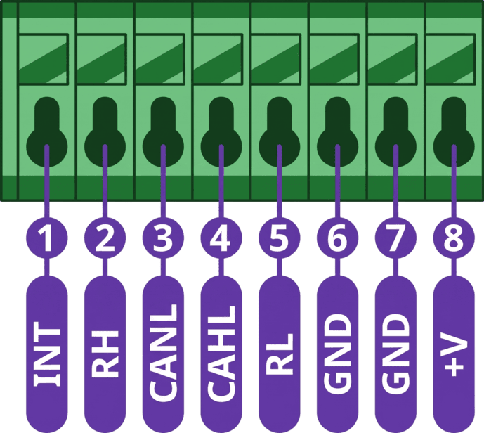
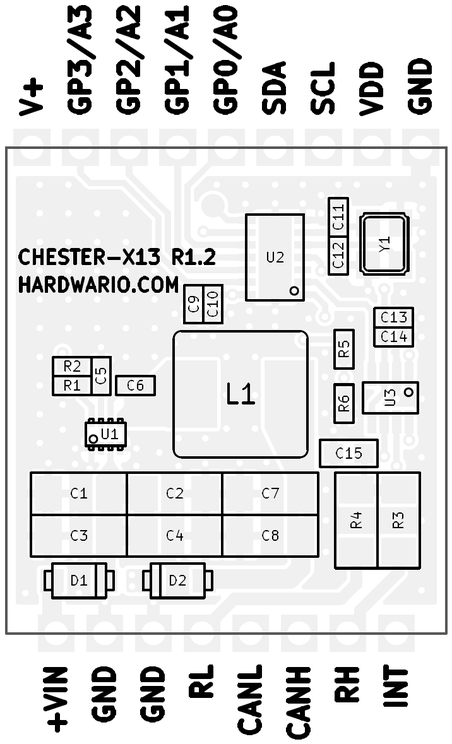

import Image from '@theme/IdealImage';

# CHESTER-X13 {#chester-x13}

**CHESTER-X13** je rozšiřující modul platformy CHESTER pro **sběrnici CAN** s podporou **CAN FD**.

<Image img={require('../../../../../chester/extension-modules/images/chester-x13-top.png')} alt="3D model červené desky CHESTER-X13 R1.2 s řadičem CAN MCP2518FD, krystalem 20 MHz, transceiverem TCAN3413 a tlumivkou snižujícího měniče"/>

## Přehled modulu {#module-overview}

Modul CHESTER-X13 přidává rozhraní **CAN / CAN FD** s externím řadičem CAN **MCP2518FD**, který se základní deskou CHESTER komunikuje po **SPI**. Fyzickou sběrnici budí transceiver **TCAN3413** na desce a linky **CANH** / **CANL** jsou vyvedené na svorkovnici. Zakončovací rezistory sběrnice na desce jsou ve výchozím stavu odpojené, takže modul lze zapojit kamkoli na sběrnici.

Modul může běžet přímo ze základní desky CHESTER. Případně lze na +VIN připojit externí linku 5-28 V DC, která napájí snižující měnič **TPS62933** na desce; jeho pevný výstup **5 V** pak napájí základní desku CHESTER. Vstup chrání Schottkyho diody (**PMEG6010ELR**). Výstup přerušení signalizuje základní desce CHESTER, že řadič CAN potřebuje obsluhu.

## Klíčové vlastnosti {#key-features}

* **CAN a CAN FD:** Drátové připojení s řadičem CAN MCP2518FD.
* **Rozhraní k hostu po SPI:** K základní desce CHESTER se připojuje po SPI.
* **Transceiver na desce:** Fyzickou sběrnici CAN budí transceiver TCAN3413.
* **Volitelné zakončení sběrnice:** Zakončovací rezistor ~120 Ω na desce, ve výchozím stavu odpojený.
* **Flexibilní napájení:** Běží ze základní desky CHESTER, nebo z volitelné linky 5-28 V DC na +VIN.
* **Ochrana vstupu:** Schottkyho diody (PMEG6010ELR) na napájecím vstupu.
* **Výstup přerušení:** Vyhrazená linka přerušení k základní desce CHESTER.

## Typické aplikace {#typical-applications}

* **Průmyslové sítě CAN:** Připojení zařízení CHESTER ke sběrnici CAN / CAN FD.
* **Monitorování strojů a zařízení:** Čtení dat ze zařízení s rozhraním CAN.
* **Mobilní stroje a vozidla:** Telemetrie ze zemědělských, stavebních a dalších mobilních strojů.
* **Energetické systémy:** Monitorování generátorů, střídačů a bateriových systémů s rozhraním CAN.
* **Dodatečný sběr dat:** Odběr dat z existující sběrnice CAN.

## Technické parametry {#technical-specifications}

| Parametr | Hodnota |
| :--- | :--- |
| **Typ rozhraní** | CAN / CAN FD |
| **Bitová rychlost** | Až 1 Mbit/s (klasický CAN), až 5 Mbit/s (CAN FD) |
| **Řadič CAN** | MCP2518FD (externí, SPI) |
| **Transceiver CAN** | TCAN3413 |
| **Rozhraní k hostu** | SPI |
| **Zakončení sběrnice** | ~120 Ω na desce, ve výchozím stavu odpojené |
| **Napájecí vstup (+VIN)** | 5-28 V DC (volitelné externí napájení) |
| **Napájecí výstup (+V)** | Pevných 5 V, napájí základní desku CHESTER |
| **Výstup sběrnice** | CANH / CANL na svorkovnici |
| **Rozhraní desky** | Půlené prokovené otvory (castellated) na dvou protilehlých hranách, deska je připájená k základní desce CHESTER |
| **Revize hardwaru** | R1.2 |

## Klíčové součástky {#key-components}

| Součástka | Typové označení | Popis |
| :--- | :--- | :--- |
| **Řadič CAN** | MCP2518FD | Externí řadič CAN FD s rozhraním SPI |
| **Transceiver CAN** | TCAN3413 | Transceiver CAN FD (rozhraní k fyzické sběrnici) |
| **Měnič DC-DC** | TPS62933 | Snižující měnič, vstup 5-28 V DC |
| **Ochrana vstupu** | PMEG6010ELR | Schottkyho diody pro ochranu vstupu |

## Zapojení pinů {#pin-configuration}

Modul používá standardizované rozvržení konektoru kompatibilní se slotem pro rozšiřující moduly CHESTER.

:::note
Zobrazené zapojení pinů platí pro základní desku CHESTER-M CGLS.
:::

### Zapojení konektoru CHESTER-X13 {#chester-x13-connector-pinout}

| Pin | Signál | Typ | Popis |
| :---: | :--- | :--- | :--- |
| 1 | INT | Výstup | Výstup přerušení k základní desce CHESTER |
| 2 | RH | Zakončení CAN | Vývod zakončení pro CANH (spojením s CANH zapnete zakončení na desce) |
| 3 | CANH | Sběrnice CAN | Linka sběrnice CAN, high |
| 4 | CANL | Sběrnice CAN | Linka sběrnice CAN, low |
| 5 | RL | Zakončení CAN | Vývod zakončení pro CANL (spojením s CANL zapnete zakončení na desce) |
| 6 | GND | Zem | Systémová zem |
| 7 | GND | Zem | Systémová zem |
| 8 | +VIN | Napájecí vstup | Volitelný externí stejnosměrný vstup do snižujícího měniče na desce (5-28 V DC) |

:::info
Modul může běžet přímo ze základní desky CHESTER. Když je na **+VIN** (pin 8) připojené externí napájení **5-28 V DC**, vytváří snižující měnič TPS62933 na desce pevných **5 V**, kterými se napájí základní deska CHESTER.
:::

### Rozhraní k hostu (SPI) {#host-interface-spi}

Na rozdíl od většiny modulů CHESTER-X (které používají **I²C**) komunikuje modul CHESTER-X13 se základní deskou CHESTER po **SPI**. Řadič MCP2518FD se řídí přes piny GP slotu modulu:

| Pin CHESTER-X | Funkce SPI | Signál MCP2518FD |
| :--- | :--- | :--- |
| GP0 | SCLK | SCK |
| GP1 | MOSI | SDI |
| GP2 | MISO | SDO |
| GP3 | CS | NCS |

Výstup přerušení (INT) čipu MCP2518FD je vyvedený na svorku **INT** modulu (pin 1). Viz podsekce [Pin přerušení](#interrupt-pin) níže.

### Pin přerušení {#interrupt-pin}

Řadič MCP2518FD signalizuje události (například přijatý rámec CAN) na svém výstupu přerušení, který je vyvedený na svorku **INT** modulu (pin 1). Toto přerušení **musí být propojené se svorkou INT základní desky CHESTER**, aby ho deska mohla zaznamenat. Na základní desce **CHESTER-M CGLS** přidejte propojovací vodič ze svorkovnice rozšiřujícího modulu na svorku INT základní desky. Zapojení níže je znázorněné pro modul ve **slotu B**; modul v jiném slotu se stejným způsobem připojí ke svorce INT daného slotu.

* Příklad: zapojení přerušení pro modul ve slotu B (CHESTER-M CGLS).

## Připojení sběrnice CAN {#can-bus-connection}

Sběrnice CAN se zapojuje přímo na piny svorkovnice **CANH** (pin 3) a **CANL** (pin 4). Použijte **kroucenou dvojlinku** s charakteristickou impedancí **120 Ω**, sběrnici veďte v **lineární (řetězové) topologii** (vyhněte se hvězdicovému rozvržení a dlouhým odbočkám) a nekroucenou část kabeláže u svorkovnice udržujte **co nejkratší**.

Rozhraní CAN **není galvanicky oddělené**, takže všechny uzly sběrnice musí mít společnou zem. Zem sběrnice **GND** připojte na jeden z pinů GND svorkovnice (pin 6 nebo 7).

### Zakončovací rezistory {#termination-resistors}

Sběrnice CAN musí být na **obou fyzických koncích** zakončená rezistorem **120 Ω** mezi CANH a CANL. Modul CHESTER-X13 má zakončovací rezistor na desce, který je ve výchozím stavu **odpojený** (uzel uprostřed sběrnice zakončený být nesmí).

Připojte ho **jen tehdy, když je modul na konci sběrnice**: na svorkovnici spojte **CANH s RH** (pin 3 s pinem 2) a **CANL s RL** (pin 4 s pinem 5).

### Průchod krabičkou {#enclosure-feed-through}

Kabel CAN lze do krabičky přivést dvěma způsoby:

- **Kabelová vývodka (výchozí):** vodiče CAN protáhnete vývodkou ve stěně krabičky a zapojíte do svorkovnice.
- **Panelový konektor (na vyžádání):** uživatel kabel CAN jen zapojí do konektoru ve stěně krabičky a uvnitř nezůstane žádná volná kabeláž. Dodáváme na vyžádání.

## Kompatibilní konfigurace CHESTER {#compatible-chester-configurations}

Modul CHESTER-X13 lze použít s různými konfiguracemi základních desek CHESTER. Níže jsou příklady kompatibilních sestav:

<h4>CHESTER-M (CGLS)</h4>

<h4>CHESTER-C4</h4>

## Použití s CHESTER SDK {#chester-sdk-usage}

V CHESTER SDK se modul CHESTER-X13 používá přes shieldy `ctr_x13_a` a `ctr_x13_b`, nebo přes funkce `hardware-chester-x13-a` a `hardware-chester-x13-b` nástroje [Project Generator](/chester/firmware-sdk/how-to-project-generator).

- [Ukázka použití v SDK](https://github.com/hardwario/chester-sdk/tree/main/samples/chester_x13)

## Schémata {#schematic-diagrams}

Kompletní schéma (hlavní list, rozhraní CAN a napájení) je k dispozici jako PDF:

- [Schéma (PDF)](pathname:///chester/extension-modules/schematics/hio-chester-x13-r1.2.pdf)
- [Interaktivní prohlížeč CHESTER-X13](pathname:///download/ibom/hio-chester-x13-r1.2.html)

## Výkres modulu {#module-drawing}

