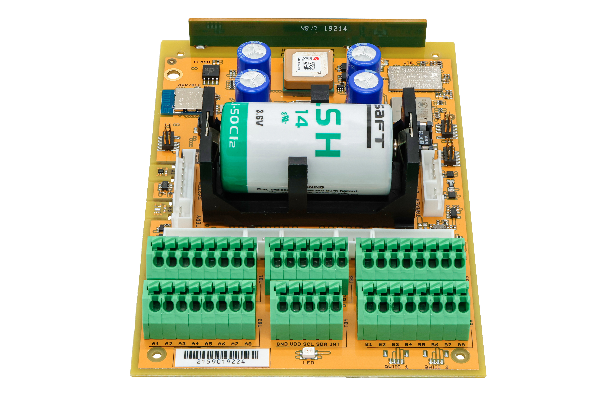
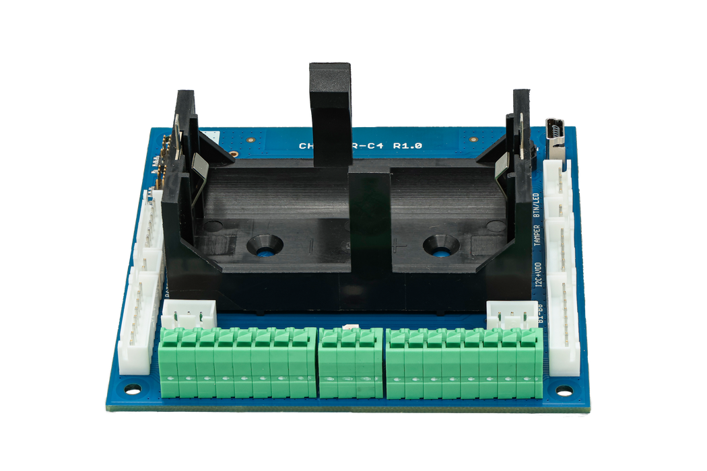
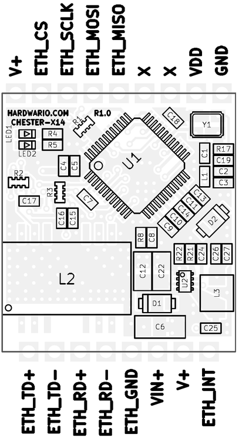

import Image from '@theme/IdealImage';

# CHESTER-X14 {#chester-x14}

**CHESTER-X14** je rozšiřující modul platformy CHESTER pro drátový **Ethernet 10/100**.

<Image img={require('../../../../../chester/extension-modules/images/chester-x14-top.png')} alt="3D model červené desky CHESTER-X14 R1.0 s kontrolérem W5500 v pouzdře QFP, magnetikou Ethernetu, krystalem 25 MHz a tlumivkou snižujícího měniče"/>

## Přehled modulu {#module-overview}

Modul CHESTER-X14 přidává rozhraní Ethernet 10/100 Mb/s s kontrolérem **W5500**, který má hardwarový zásobník TCP/IP, integruje MAC i PHY a se základní deskou CHESTER komunikuje po **SPI**. Magnetika Ethernetu na desce (**ALANL100X1-DE12DT**) galvanicky odděluje rozhraní a upravuje signál. Diferenciální přijímací a vysílací páry jsou vyvedené na svorkovnici, kam se zapojují jednotlivé vodiče ethernetového kabelu.

Modul může běžet přímo ze základní desky CHESTER. Případně lze na +VIN připojit externí linku 5-28 V DC, která napájí snižující měnič **TPS62933** na desce; jeho pevný výstup **5 V** (+V) pak napájí základní desku CHESTER. Vstup chrání Schottkyho diody (**PMEG6010ELR**). Výstup přerušení signalizuje základní desce CHESTER, že kontrolér Ethernetu potřebuje obsluhu.

## Klíčové vlastnosti {#key-features}

* **10/100 Ethernet:** Drátové připojení přes kontrolér W5500 s hardwarovým zásobníkem TCP/IP.
* **Rozhraní k hostu po SPI:** K základní desce CHESTER se připojuje po SPI.
* **Integrovaná magnetika a oddělení:** Transformátor Ethernetu na desce (ALANL100X1-DE12DT) zajišťuje galvanické oddělení.
* **Flexibilní napájení:** Běží ze základní desky CHESTER, nebo z volitelné linky 5-28 V DC na +VIN.
* **Ochrana vstupu:** Schottkyho diody (PMEG6010ELR) na napájecím vstupu.
* **Výstup přerušení:** Vyhrazená linka přerušení k základní desce CHESTER.
* **Stavové LED:** Indikace spojení (zelená) a aktivity (červená), které řídí čip W5500.

## Typické aplikace {#typical-applications}

* **Pevné připojení:** Drátový Ethernet tam, kde mobilní síť nemá pokrytí nebo ji nechcete použít.
* **Průmyslové sítě:** Připojení zařízení CHESTER do místní průmyslové sítě LAN.
* **Automatizace budov:** Drátová páteř pro monitorování budov a provozů.
* **Brány:** Drátové připojení (uplink) pro uzly, které sbírají data.

## Technické parametry {#technical-specifications}

| Parametr | Hodnota |
| :--- | :--- |
| **Typ rozhraní** | Ethernet 10/100 Mb/s |
| **Kontrolér Ethernetu** | W5500 (hardwarový TCP/IP, integrovaný MAC + PHY) |
| **Rozhraní k hostu** | SPI |
| **Magnetika** | Integrovaná (ALANL100X1-DE12DT) |
| **Galvanické oddělení** | Ano, zajišťuje ho magnetika Ethernetu na desce |
| **Napájecí vstup (+VIN)** | 5-28 V DC (volitelné externí napájení) |
| **Napájecí výstup (+V)** | Pevných 5 V, napájí základní desku CHESTER |
| **Výstup Ethernetu** | Diferenciální páry Rx/Tx na svorkovnici |
| **Rozhraní desky** | Půlené prokovené otvory (castellated) na dvou protilehlých hranách, deska je připájená k základní desce CHESTER |
| **Revize hardwaru** | R1.0 |

## Klíčové součástky {#key-components}

| Součástka | Typové označení | Popis |
| :--- | :--- | :--- |
| **Kontrolér Ethernetu** | W5500 | Vestavný kontrolér Ethernetu s hardwarovým zásobníkem TCP/IP a rozhraním SPI (MAC + PHY) |
| **Magnetika Ethernetu** | ALANL100X1-DE12DT | Integrovaný LAN transformátor pro rozhraní 10/100 |
| **Měnič DC-DC** | TPS62933 | Snižující měnič, vstup 5-28 V DC |
| **Ochrana vstupu** | PMEG6010ELR | Schottkyho diody pro ochranu vstupu |

## Zapojení pinů {#pin-configuration}

Modul používá standardizované rozvržení konektoru kompatibilní se slotem pro rozšiřující moduly CHESTER.

:::note
Zobrazené zapojení pinů platí pro základní desku CHESTER-M CGLS.
:::

### Zapojení konektoru CHESTER-X14 {#chester-x14-connector-pinout}

| Pin | Signál | Typ | Popis |
| :---: | :--- | :--- | :--- |
| 1 | INT | Výstup | Výstup přerušení k základní desce CHESTER |
| 2 | +V | Napájecí výstup | Pevných 5 V ze snižujícího měniče na desce (napájí základní desku CHESTER) |
| 3 | +VIN | Napájecí vstup | Volitelný externí stejnosměrný vstup do snižujícího měniče na desce (5-28 V DC) |
| 4 | GND | Zem | Systémová zem |
| 5 | Rx- | Ethernet | Přijímací pár (záporný) |
| 6 | Rx+ | Ethernet | Přijímací pár (kladný) |
| 7 | Tx- | Ethernet | Vysílací pár (záporný) |
| 8 | Tx+ | Ethernet | Vysílací pár (kladný) |

:::info
Modul může běžet přímo ze základní desky CHESTER. Když je na **+VIN** (pin 3) připojené externí napájení **5-28 V DC**, vytváří snižující měnič TPS62933 na desce pevných **5 V** na **+V** (pin 2), kterými se napájí základní deska CHESTER.
:::

### Rozhraní k hostu (SPI) {#host-interface-spi}

Na rozdíl od většiny modulů CHESTER-X (které používají **I²C**) komunikuje modul CHESTER-X14 se základní deskou CHESTER po **SPI**. Kontrolér W5500 se řídí přes piny GP slotu modulu:

| Pin CHESTER-X | Funkce SPI | Signál W5500 |
| :--- | :--- | :--- |
| GP0 | MISO | ETH_MISO |
| GP1 | MOSI | ETH_MOSI |
| GP2 | SCLK | ETH_SCLK |
| GP3 | CS | ETH_CS |

Výstup přerušení (INTn) čipu W5500 je vyvedený na svorku **INT** modulu (pin 1). Viz podsekce [Pin přerušení](#interrupt-pin) níže.

### Pin přerušení {#interrupt-pin}

Kontrolér W5500 signalizuje události (například příchozí paket) na svém výstupu přerušení, který je vyvedený na svorku **INT** modulu (pin 1). Toto přerušení **musí být propojené se svorkou INT základní desky CHESTER**, aby ho deska mohla zaznamenat. Na základní desce **CHESTER-M CGLS** přidejte propojovací vodič ze svorkovnice rozšiřujícího modulu na svorku INT základní desky. Zapojení níže je znázorněné pro modul ve **slotu B**; modul v jiném slotu se stejným způsobem připojí ke svorce INT daného slotu.

* Příklad: zapojení přerušení pro modul ve slotu B (CHESTER-M CGLS).

## Připojení Ethernetu {#ethernet-connection}

Magnetika Ethernetu je přímo na modulu, takže se jednotlivé vodiče kabelu zapojují rovnou na piny svorkovnice (**Rx-**, **Rx+**, **Tx-**, **Tx+**). **Externí magnetika není potřeba**: magnetika na desce zajišťuje i **galvanické oddělení** rozhraní Ethernet.

Každý diferenciální pár (Rx a Tx) veďte jako **kroucenou dvojlinku** kabelem **Cat5e** nebo lepším a nekroucenou část kabeláže u svorkovnice udržujte **co nejkratší**. Standardní spoje 10/100BASE-TX (které W5500 používá) zvládnou délku kabelu až **100 m**.

Ethernetový kabel zapojte do svorkovnice podle tabulky níže. Pin RJ-45 a barva vodiče odpovídají standardu **T568B**; pin CHESTER-X14 je převzatý z tabulky zapojení výše.

| Pin RJ-45 | Vodič (T568B) | Signál Ethernetu | Pin CHESTER-X14 |
| :---: | :--- | :--- | :---: |
| 1 | Bílo-oranžový | ETH_TD+ (Tx+) | 8 |
| 2 | Oranžový | ETH_TD- (Tx-) | 7 |
| 3 | Bílo-zelený | ETH_RD+ (Rx+) | 6 |
| 6 | Zelený | ETH_RD- (Rx-) | 5 |
| 8 | Hnědý | ETH_GND (GND) | 4 |

### Průchod krabičkou {#enclosure-feed-through}

Ethernetový kabel lze do krabičky přivést dvěma způsoby:

- **Kabelová vývodka (výchozí):** izolované vodiče Ethernetu protáhnete vývodkou ve stěně krabičky a zapojíte do svorkovnice.
- **Panelový konektor RJ-45 (na vyžádání):** uživatel zapojí standardní ethernetový kabel do zdířky RJ-45 ve stěně krabičky a uvnitř nezůstane žádná volná kabeláž. Dodáváme na vyžádání.

## Stavové LED {#status-leds}

Dvě stavové LED jsou pod potiskem **HARDWARIO.COM** v levém horním rohu desky. Obě řídí přímo kontrolér W5500:

| LED | Signál W5500 | Barva | Funkce |
| :--- | :--- | :--- | :--- |
| **LED1** | ACTLED | Červená | Aktivita Ethernetu: mění stav při vysílání nebo příjmu rámců |
| **LED2** | LINKLED | Zelená | Spojení Ethernetu: svítí, když je navázané spojení se sítí |

## Kompatibilní konfigurace CHESTER {#compatible-chester-configurations}

Modul CHESTER-X14 lze použít s různými konfiguracemi základních desek CHESTER. Níže jsou příklady kompatibilních sestav:

<h4>CHESTER-M (CGLS)</h4>

<h4>CHESTER-C4</h4>

## Použití s CHESTER SDK {#chester-sdk-usage}

V CHESTER SDK se modul CHESTER-X14 používá přes shieldy `ctr_x14_a` a `ctr_x14_b`, nebo přes funkce `hardware-chester-x14-a` a `hardware-chester-x14-b` nástroje [Project Generator](/chester/firmware-sdk/how-to-project-generator).

- [Ukázka použití v SDK](https://github.com/hardwario/chester-sdk/tree/main/samples/chester_x14)

## Schémata {#schematic-diagrams}

Kompletní schéma (hlavní list, rozhraní Ethernet a napájení) je k dispozici jako PDF:

- [Schéma (PDF)](pathname:///chester/extension-modules/schematics/hio-chester-x14-r1.0.pdf)
- [Interaktivní prohlížeč CHESTER-X14](pathname:///download/ibom/hio-chester-x14-r1.0.html)

## Výkres modulu {#module-drawing}

