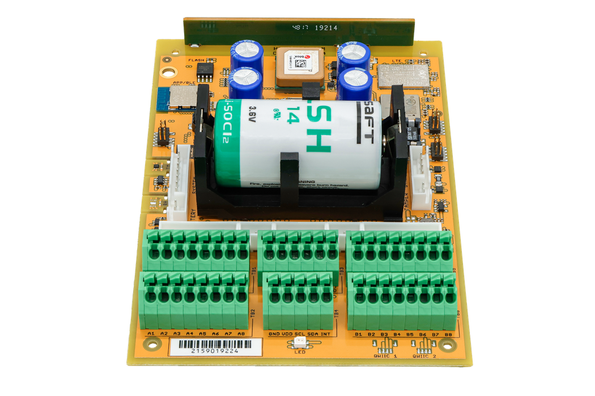

import Image from '@theme/IdealImage';

# CHESTER-X6 {#chester-x6}

**CHESTER-X6** je rozšiřující modul se **sběrnicí HARDWARIO S-Wire** pro platformu CHESTER.

<Image img={require('../../../../../chester/extension-modules/images/chester-x6-top.png')} alt="Pohled na desku CHESTER-X6 shora s převodníkem UART SC16IS740, expandérem TCA9534A a zvyšujícím měničem 5 V"/>

## Přehled modulu {#module-overview}

Modul CHESTER-X6 připojuje k platformě CHESTER periferie **S-Wire** s nízkou spotřebou po jednoduchém třívodičovém spoji: **+5 V**, **GND** a jediná linka **DATA**. Protokol S-Wire běží na jednotce UART převodníku I²C na UART **SC16IS740**; tranzistorový budič převádí jeho signály UART na jedinou poloduplexní linku DATA s úrovní 5 V a ochranou proti ESD. Modul se celý ovládá po sběrnici **I²C**, na které má dvě zařízení: převodník UART a expandér GPIO **TCA9534A**, který spíná napájení periferií, resetuje převodník a obsluhuje jeho přerušení.

Zvyšující měnič na desce (**TPS61099**) vytváří stabilizovaných **5 V** pro napájení připojených periferií. Protože napětí zvyšuje z větve +V zařízení CHESTER, dodá modul periferiím čistých 5 V, **i když CHESTER běží z baterie**. Výstup 5 V se zapíná po I²C (přes expandér), takže napájení periferií lze mezi odečty vypnout a ušetřit energii.

## Klíčové vlastnosti {#key-features}

* **Rozhraní HARDWARIO S-Wire:** Připojuje periferie S-Wire s nízkou spotřebou po třívodičovém spoji (+5 V, GND, DATA).
* **Řízení po I²C:** Dvě zařízení na I²C: převodník UART SC16IS740 (0x4D) a expandér TCA9534A (0x39); piny GP se nepoužívají.
* **Zvyšující měnič 5 V na desce:** TPS61099 dodává periferiím stabilizovaných 5 V, i když CHESTER běží z baterie.
* **Spínané napájení periferií:** Výstup 5 V se zapíná po I²C, takže ho lze mezi odečty vypnout.
* **Chráněná linka DATA:** Poloduplexní jednovodičový budič s ochranou proti ESD.

## Typické aplikace {#typical-applications}

* **Periferie S-Wire:** Připojení senzorů a periferií HARDWARIO S-Wire k zařízení CHESTER.
* **Řetězení senzorů:** Zapojení několika periferií S-Wire na jednu sběrnici.
* **Napájené vzdálené periferie:** Periferie, které potřebují stabilizovaných 5 V ze zařízení napájeného z baterie.
* **Rozšíření o periferie s nízkou spotřebou:** Doplnění instalace CHESTER o jednoduchou sběrnici periferií s malým počtem vodičů.

## Technické parametry {#technical-specifications}

| Parametr | Hodnota |
| :--- | :--- |
| **Typ modulu** | Rozhraní sběrnice HARDWARIO S-Wire |
| **Rozhraní periferií** | S-Wire (třívodičové: +5 V, GND, DATA) |
| **Datová linka** | Jediná poloduplexní linka DATA s ochranou proti ESD |
| **Rozhraní k hostu** | I²C (převodník UART 0x4D + expandér GPIO 0x39) |
| **Napájení periferií** | Stabilizovaných 5,0 V (zvyšující měnič na desce), spínané po I²C |
| **Převodník UART** | SC16IS740IPW (13,56 MHz) |
| **Napájení logiky (VDD)** | 3,0 V |
| **Rozhraní desky** | Půlené prokovené otvory (castellated) na dvou protilehlých hranách, deska je připájená k základní desce CHESTER |
| **Revize hardwaru** | R1.0 |

## Klíčové součástky {#key-components}

| Součástka | Typové označení | Popis |
| :--- | :--- | :--- |
| **Převodník I²C na UART** | SC16IS740IPW | Jeden UART s rozhraním I²C (adresa 0x4D); jednotka UART pro S-Wire |
| **Expandér GPIO** | TCA9534APW | Expandér GPIO na I²C (adresa 0x39); spíná zvyšující měnič 5 V, resetuje převodník a obsluhuje jeho přerušení |
| **Zvyšující měnič** | TPS61099YFF | Vytváří z +V napájení periferií 5 V |

## Zapojení pinů {#pin-configuration}

Modul používá standardizované rozvržení konektoru kompatibilní se slotem pro rozšiřující moduly CHESTER.

:::note
Zobrazené zapojení pinů platí pro základní desku CHESTER-M CGLS.
:::

### Zapojení konektoru CHESTER-X6 {#chester-x6-connector-pinout}

| Pin | Signál | Typ | Popis |
| :---: | :--- | :--- | :--- |
| 1 | +V | Napájení | Systémová kladná větev (napětí závisí na variantě napájení zařízení CHESTER) |
| 2 | +5V | Napájecí výstup | Stabilizované napájení periferií 5,0 V (ze zvyšujícího měniče na desce) |
| 3 | GND | Zem | Systémová zem |
| 4 | DATA | S-Wire | Datová linka S-Wire |
| 5 | DATA | S-Wire | Datová linka S-Wire (stejná síť jako pin 4) |
| 6 | GND | Zem | Systémová zem |
| 7 | +5V | Napájecí výstup | Stabilizované napájení periferií 5,0 V (stejná síť jako pin 2) |
| 8 | +V | Napájení | Systémová kladná větev (stejná síť jako pin 1) |

:::info
Svorkovnice vyvádí jedinou sběrnici S-Wire na osm **zrcadlově** uspořádaných pinů: piny 4 a 5 jsou stejná síť **DATA**, piny 2 a 7 stejné **+5 V**, piny 1 a 8 stejné **+V** a piny 3 a 6 GND. Periferie tak lze zapojit z obou stran nebo **řetězit**. `+5V` je stabilizované napájení periferií ze zvyšujícího měniče na desce (spínané po I²C); `+V` je systémová kladná větev a její napětí závisí na variantě napájení zařízení CHESTER.
:::

### Rozhraní k hostu (I²C) {#host-interface-ic}

Modul CHESTER-X6 se ovládá výhradně po standardní sběrnici **I²C**, na které má dvě zařízení:

| Zařízení | Adresa I²C | Funkce |
| :--- | :--- | :--- |
| SC16IS740IPW | 0x4D | Převodník I²C na UART. Jednotka UART pro S-Wire (TX/RX k budiči linky) |
| TCA9534APW | 0x39 | Expandér GPIO. Zapíná zvyšující měnič 5 V, resetuje převodník a obsluhuje jeho přerušení |

Veškerý provoz S-Wire jde přes převodník UART, napájení periferií, reset i přerušení obsluhuje expandér. Modul proto ze slotu potřebuje jen sběrnici I²C (SDA/SCL) a napájení. Piny GP slotu se nepoužívají.

## Připojení S-Wire {#s-wire-connection}

Každou periferii S-Wire zapojte do svorkovnice: **DATA** (pin 4 nebo 5), **+5V** (pin 2 nebo 7) pro napájení a **GND** (pin 3 nebo 6). Protože jsou piny DATA, +5 V, +V a GND na svorkovnici zrcadlené, lze periferie **řetězit**: jednu zapojíte na piny 1–4 a druhou na piny 5–8, nebo sběrnici provlečete dál.

Všechny periferie musí mít s modulem společnou zem **GND**. Než začnete s periferiemi komunikovat, zapněte po I²C (přes expandér) napájení 5 V.

### Průchod krabičkou {#enclosure-feed-through}

Kabel S-Wire lze do krabičky přivést dvěma způsoby:

- **Kabelová vývodka (výchozí):** vodiče protáhnete vývodkou ve stěně krabičky a zapojíte do svorkovnice.
- **Panelový konektor (na vyžádání):** uživatel kabel jen zapojí do konektoru ve stěně krabičky a uvnitř nezůstane žádná volná kabeláž. Dodáváme na vyžádání.

## Kompatibilní konfigurace CHESTER {#compatible-chester-configurations}

Modul CHESTER-X6 lze použít s různými konfiguracemi základních desek CHESTER. Níže jsou příklady kompatibilních sestav:

<h4>CHESTER-M (CGLS)</h4>

<h4>CHESTER-C4</h4>

## Schémata {#schematic-diagrams}

Kompletní schéma (převodník UART SC16IS740, expandér TCA9534A, budič linky S-Wire a zvyšující měnič 5 V) je k dispozici jako PDF:

- [Schéma (PDF)](pathname:///chester/extension-modules/schematics/hio-chester-x6-r1.0.pdf)
- [Interaktivní prohlížeč CHESTER-X6](pathname:///download/ibom/hio-chester-x6-r1.0.html)

## Výkres modulu {#module-drawing}

