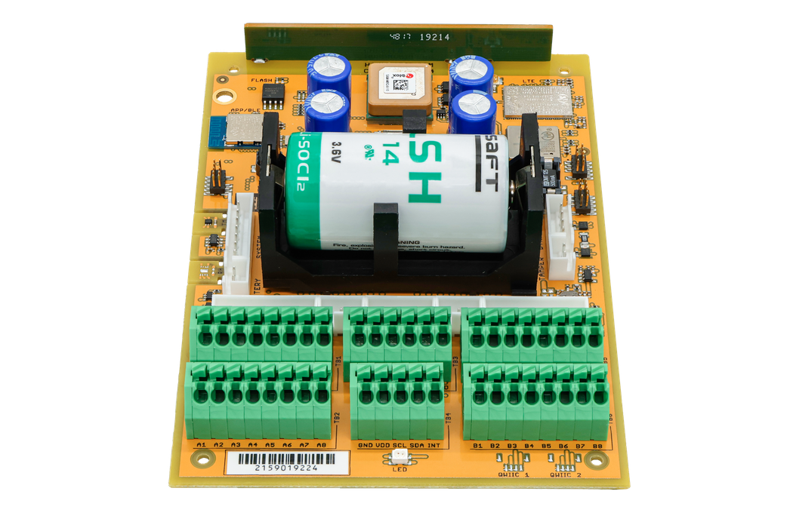

import Image from '@theme/IdealImage';

# CHESTER-X7 {#chester-x7}

**CHESTER-X7** je rozšiřující modul s **analogovým vstupem** pro platformu CHESTER, s jedním diferenciálním vstupem, jedním nesymetrickým napěťovým vstupem a výstupem 5 V pro napájení externích sond.

<Image img={require('../../../../../chester/extension-modules/images/chester-x7-top.png')} alt="Pohled na desku CHESTER-X7 shora se vstupním zesilovačem OPA4387 a obvody boost převodníku a LDO"/>

## Přehled modulu {#module-overview}

CHESTER-X7 poskytuje **diferenciální vstup** (INP/INM) pro proudové sondy a další průmyslové senzory a nesymetrický **napěťový vstup** (VIN) pro signály 0–28 V. Diferenciální vstup je oddělený přesnými stupni operačních zesilovačů bez driftu (**OPA4387**) a přiveden na analogové vstupy zařízení CHESTER (INP → A0, INM → A1). Napěťový vstup je zmenšený přesným rezistorovým děličem a čte se na A2. CHESTER-X7 nemá rozhraní I²C ani SPI. Všechny tři signály čte přímo ADC základní desky CHESTER.

Modul také vytváří stabilizovaný **výstup 5.0 V** (VOUT) pro napájení připojených sond. Vzniká z větve +V boost převodníkem (**TPS61099**) a za ním nízkošumovým LDO (**TPS7A2050**) a zapíná se z firmwaru pinem **GP3/A3** slotu, takže lze napájení sond mezi měřeními vypnout a šetřit energii.

## Klíčové vlastnosti {#key-features}

* **Diferenciální vstup:** Jeden diferenciální vstup (INP/INM) pro proudové sondy a průmyslové senzory, oddělený přesnými stupni OPA4387.
* **Napěťový vstup:** Jeden nesymetrický vstup 0–28 V (VIN), přesně dělený pro ADC zařízení CHESTER.
* **Analogové rozhraní:** Signály se čtou přímo na analogových vstupech CHESTER (A0/A1/A2), I²C ani SPI není potřeba.
* **Přepínatelné napájení sond:** Stabilizovaný výstup 5.0 V (VOUT) pro napájení sond, zapínaný přes GP3/A3.
* **Přesná analogová část:** Operační zesilovač OPA4387 bez driftu a rezistory 0,1 % pro přesné měření s malým driftem.

## Typické aplikace {#typical-applications}

* **Měření proudu:** Odečet proudových sond, proudových transformátorů (CT) a senzorů proudu se shuntem.
* **Připojení průmyslových senzorů:** Diferenciální senzory a snímače, které potřebují napájený a oddělený vstupní stupeň.
* **Monitorování napětí:** Měření stejnosměrných napětí do 28 V: bateriové banky, napájecí větve a průmyslové signály.
* **Monitorování procesů a energií:** Sledování zatížení, výkonu a spotřeby v průmyslových a budovních systémech.
* **Sběr analogových signálů:** Univerzální sběr nízkoúrovňových diferenciálních i nesymetrických signálů.

## Technické parametry {#technical-specifications}

| Parametr | Hodnota |
| :--- | :--- |
| **Typ modulu** | Vstupní analogový stupeň (diferenciální + napěťový) |
| **Diferenciální vstup** | INP/INM, oddělený OPA4387, čtený na A0/A1 |
| **Napěťový vstup (VIN)** | 0–28 V nesymetricky, přesně dělený, čtený na A2 |
| **Výstup napájení sond (VOUT)** | Stabilizovaných 5.0 V (boost + LDO), zapínaný přes GP3/A3 |
| **Rozhraní k hostu** | Analogové (ADC zařízení CHESTER na A0/A1/A2); bez I²C a SPI |
| **Řízení** | GP3/A3 zapíná výstup napájení sond 5.0 V |
| **Napájení logiky (VDD)** | 3.0 V |
| **Rozhraní desky** | Castellated otvory na dvou protilehlých hranách, připájené k základní desce CHESTER |
| **Revize hardwaru** | R2.1 |

## Klíčové součástky {#key-components}

| Součástka | Typové označení | Popis |
| :--- | :--- | :--- |
| **Boost převodník** | TPS61099YFF | Zvyšující převodník vytvářející mezivětev 5.5 V z +V |
| **Regulátor LDO** | TPS7A2050PDBVR | Nízkošumový LDO 5.0 V vytvářející napájení sond VOUT |
| **Přesný operační zesilovač** | OPA4387PW | Čtyřnásobný operační zesilovač bez driftu oddělující diferenciální vstup |

## Zapojení pinů {#pin-configuration}

Modul používá standardizované rozvržení konektoru kompatibilní se slotem pro rozšiřující moduly CHESTER.

:::note
Zobrazené zapojení pinů platí pro základní desku CHESTER-M CGLS.
:::

### Zapojení konektoru CHESTER-X7 {#chester-x7-connector-pinout}

| Pin | Signál | Typ | Popis |
| :---: | :--- | :--- | :--- |
| 1 | +V | Napájení | Kladná systémová větev (závisí na napájecí variantě zařízení CHESTER); napájí také boost převodník |
| 2 | GND | Zem | Systémová zemní reference |
| 3 | VDD | Napájení | Napájení logiky 3.0 V ze základní desky CHESTER |
| 4 | VIN | Analogový vstup | Nesymetrický napěťový vstup (0–28 V) |
| 5 | GND | Zem | Systémová zemní reference |
| 6 | INP | Analogový vstup | Kladný diferenciální vstup |
| 7 | INM | Analogový vstup | Záporný diferenciální vstup |
| 8 | VOUT | Napájecí výstup | Stabilizovaný výstup napájení sond 5.0 V |

:::info
`VDD` je logická větev 3.0 V a `+V` je kladná systémová větev (její napětí závisí na napájecí variantě zařízení CHESTER; napájí také boost převodník na desce). `VOUT` dodává stabilizovaných **5.0 V** pro napájení připojených sond a zapíná se z firmwaru přes **GP3/A3**.
:::

### Vedení signálů (analogové) {#signal-routing-analog}

CHESTER-X7 nemá žádné zařízení na I²C ani SPI. Měření se čtou přímo na analogových vstupech zařízení CHESTER a jeden pin GP přepíná napájení sond. Piny slotu se používají takto:

| Pin CHESTER-X | Směr | Funkce |
| :--- | :--- | :--- |
| GP0 / A0 | Analogový vstup | Oddělený kladný diferenciální vstup (INP) |
| GP1 / A1 | Analogový vstup | Oddělený záporný diferenciální vstup (INM) |
| GP2 / A2 | Analogový vstup | Zmenšený napěťový vstup (VIN, 0–28 V) |
| GP3 / A3 | Digitální výstup | Zapíná výstup napájení sond 5.0 V (VOUT) |

Obě větve diferenciálního vstupu (INP, INM) jsou oddělené přesným stupněm OPA4387 a čtené na A0 a A1; jejich rozdíl počítá firmware. Napěťový vstup (VIN) je dělený přesnou rezistorovou sítí a čtený na A2. Sběrnice I²C slotu (SDA/SCL) se nepoužívá.

## Připojení vstupů a výstupu {#input-and-output-connection}

- **Proudová sonda / diferenciální senzor:** diferenciální výstup sondy připojte na **INP** (pin 6) a **INM** (pin 7). Pokud sonda potřebuje napájení, vezměte ho z **VOUT** (pin 8, 5.0 V) a **GND**.
- **Napěťový vstup:** zdroj 0–28 V připojte na **VIN** (pin 4) a **GND**.

Všechna externě připojená zařízení musí mít s modulem společnou **GND**. Před měřením zapněte z firmwaru (GP3/A3) napájení sond 5.0 V.

### Průchod krabičkou {#enclosure-feed-through}

Kabeláž lze do krabičky přivést dvěma způsoby:

- **Kabelová vývodka (výchozí):** vodiče protáhnete vývodkou ve stěně krabičky a zapojíte do svorkovnice.
- **Konektor do panelu (na vyžádání):** externí konektor ve stěně krabičky umožní uživateli kabel zapojit, bez volné kabeláže vevnitř. Na vyžádání.

## Kompatibilní konfigurace CHESTER {#compatible-chester-configurations}

Modul CHESTER-X7 lze použít s různými konfiguracemi základních desek CHESTER. Níže jsou příklady kompatibilních sestav:

<h4>CHESTER-M (CGLS)</h4>

<h4>CHESTER-C4</h4>

## Použití s CHESTER SDK {#chester-sdk-usage}

CHESTER-X7 lze v rámci CHESTER SDK použít přes shieldy `ctr_x7_a` a `ctr_x7_b`, případně přes funkce [Project Generatoru](/chester/firmware-sdk/how-to-project-generator) `hardware-chester-x7-a` a `hardware-chester-x7-b`.

- [Ukázka použití v SDK](https://github.com/hardwario/chester-sdk/tree/main/samples/chester_x7)

## Schémata {#schematic-diagrams}

Kompletní schéma (napájení sond přes boost a LDO a vstupní stupeň pro diferenciální a napěťový vstup) je k dispozici jako PDF:

- [Schéma (PDF)](../../../../../chester/extension-modules/schematics/hio-chester-x7-r2.1.pdf)
- [Interaktivní prohlížeč CHESTER-X7](pathname:///download/ibom/hio-chester-x7-r2.1.html)

## Výkres modulu {#module-drawing}

