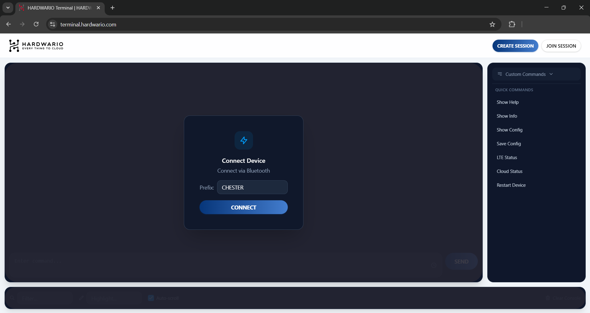
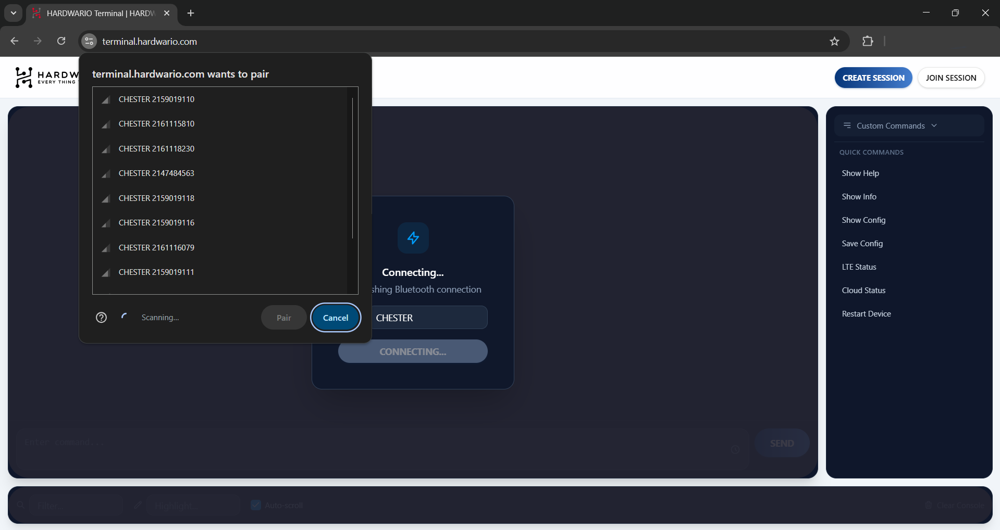
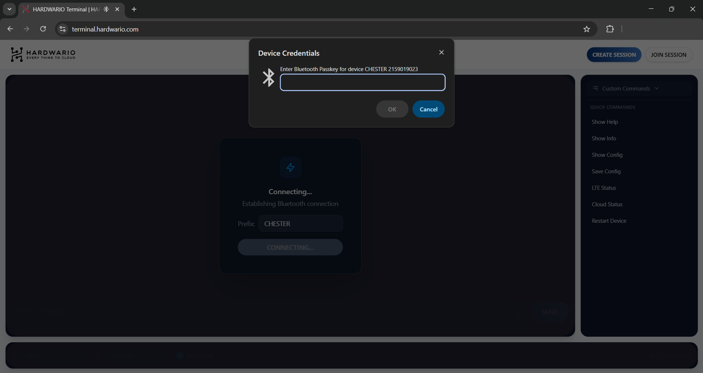
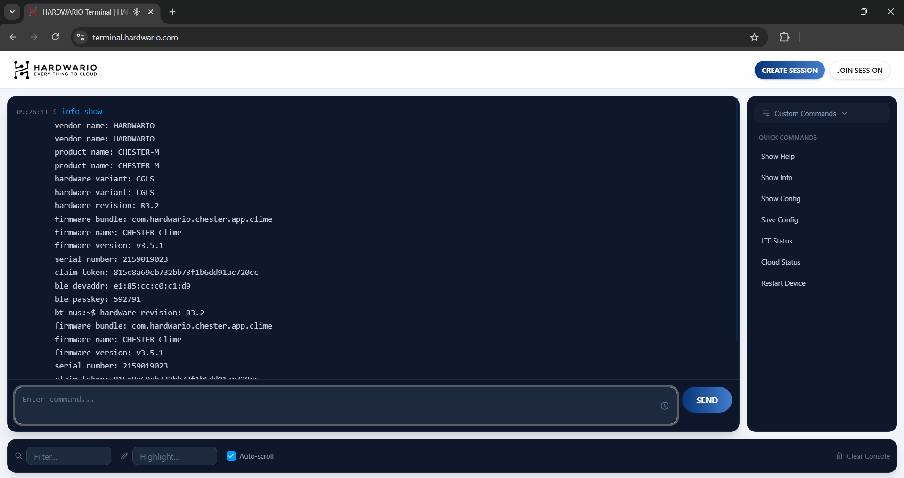
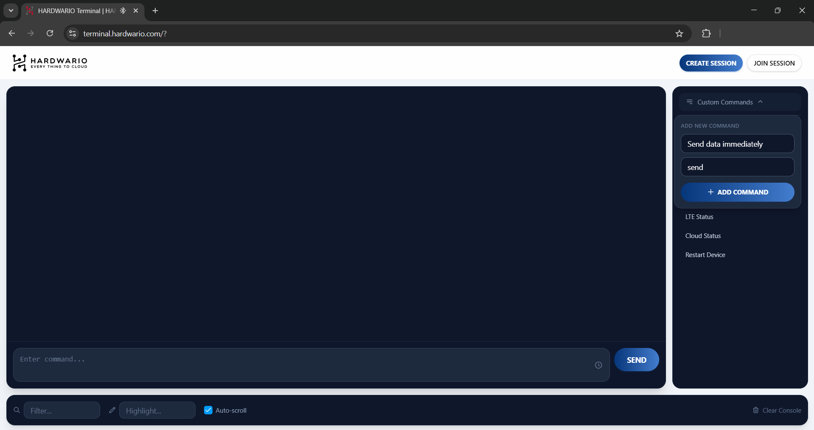
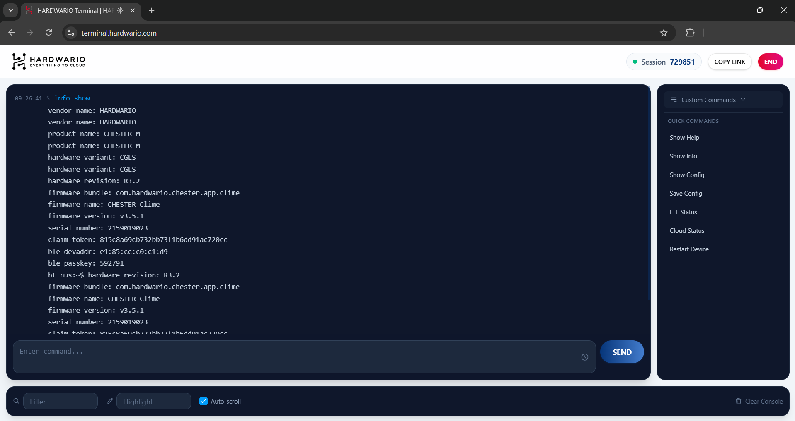
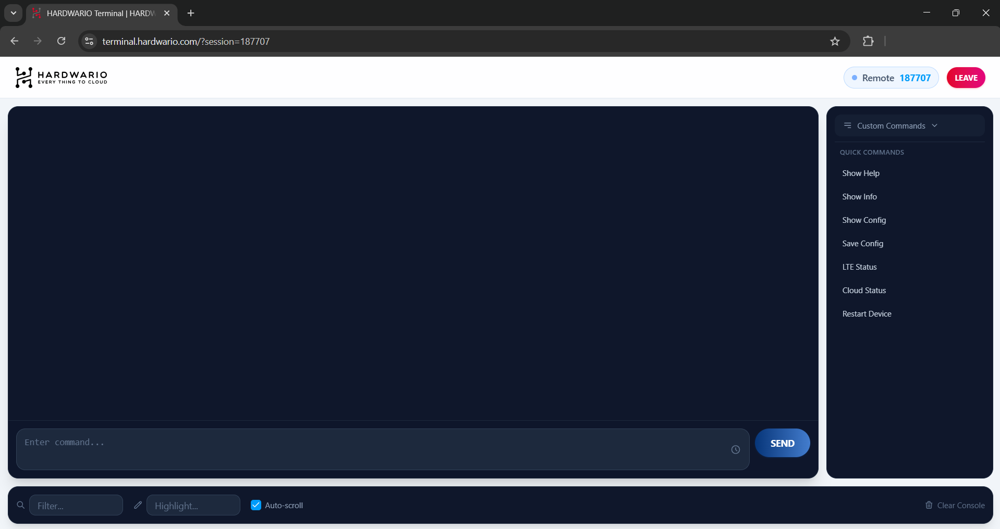

import Image from '@theme/IdealImage';

[**HARDWARIO Terminal**](https://terminal.hardwario.com/) je terminálový nástroj založený na prohlížeči Google Chrome, který umožňuje komunikovat přímo se zařízeními a moduly HARDWARIO z prohlížeče, a to **bez nutnosti** instalovat **další software**.

**Dostupné zde:** [**https://terminal.hardwario.com/**](https://terminal.hardwario.com/)  

:::info
**Upozornění**: HARDWARIO Terminal funguje **pouze v prohlížeči Google Chrome**.
:::

---

## Návod k aplikaci HARDWARIO Google Chrome Terminal {#hardwario-google-chrome-terminal-app-tutorial}

Tento návod vás provede používáním aplikace HARDWARIO Terminal, webového nástroje pro správu zařízení CHESTER přímo z prohlížeče Google Chrome.

---

## 1. Připojení zařízení CHESTER {#1-connecting-chester}

Nejprve je potřeba vytvořit Bluetooth spojení mezi počítačem a zařízením CHESTER.

* **Krok 1:** Otevřete Google Chrome a přejděte na **[https://terminal.hardwario.com/](https://terminal.hardwario.com/)**.
* **Krok 2:** Klikněte na tlačítko **Connect** ve středu obrazovky.

* **Krok 3:** Zobrazí se vyskakovací okno prohlížeče s dostupnými Bluetooth zařízeními v okolí. Předpona `CHESTER` je filtrována automaticky, takže uvidíte pouze kompatibilní zařízení CHESTER.
* **Krok 4:** Vyberte ze seznamu své zařízení a klikněte na **Pair**.

* **Krok 5:** Budete vyzváni k zadání **Bluetooth Passkey**. 
    * *Poznámka k passkey:* Passkey najdete naskenováním QR kódu na zadní straně zařízení CHESTER. Alternativně jej lze zjistit příkazem `info show` v terminálu (v mobilní aplikaci HARDWARIO Manager, v PC aplikaci HARDWARIO Monitor nebo z předchozí session v tomto webovém terminálu).
* **Krok 6:** Zadejte passkey. Aplikace si jej pro příští session zapamatuje, takže jej pro toto konkrétní zařízení nebudete muset zadávat znovu.

* **Krok 7:** Po úspěšném ověření se otevře rozhraní terminálu a můžete začít psát příkazy.

---

## 2. Rychlé příkazy {#2-quick-commands}

Na pravé straně rozhraní je panel věnovaný **rychlým příkazům** (Quick Commands). Jde o nejčastěji používané příkazy zařízení CHESTER, které lze odeslat jediným kliknutím místo ručního vypisování do terminálu. Ovládání zařízení je tak výrazně rychlejší a jednodušší.

Přehled výchozích rychlých příkazů:

* **Show Help:** Provede příkaz `help`. Vypíše všechny dostupné terminálové příkazy a jejich základní syntaxi.
* **Show Info:** Provede příkaz `info show`. Zobrazí klíčové informace o zařízení včetně verze firmwaru, sériového čísla, hardwarové revize a aktuálního napětí baterie.
* **Show Config:** Provede příkaz `config show`. Vypíše aktuální konfigurační parametry zařízení CHESTER, takže si můžete ověřit současné nastavení.
* **Save Config:** Provede příkaz `config save`. Zapíše všechny neuložené změny konfigurace do nevolatilní paměti zařízení, aby přetrvaly i po restartu.
* **LTE Status:** Provede příkaz pro zobrazení aktuálního stavu připojení k síti LTE včetně síly signálu (RSRP/RSRQ), operátora sítě a stavu spojení.
* **Cloud Status:** Provede příkaz pro kontrolu stavu spojení mezi zařízením a službami HARDWARIO Cloud.
* **Restart Device:** Provede příkaz pro restart. Bezpečně restartuje zařízení CHESTER.

---

## 3. Vlastní rychlé příkazy {#3-custom-quick-commands}

Terminál umožňuje vytvořit si vlastní rychlé příkazy pro akce, které provádíte často.

* **Krok 1:** V pravém panelu rychlých příkazů najděte nahoře nástrojovou lištu.
* **Krok 2:** Klikněte na tlačítko pro přidání nového vlastního příkazu.
* **Krok 3:** Zadejte **Label** (název, který se zobrazí na tlačítku).
* **Krok 4:** Zadejte přesný **Command**, který se má po kliknutí na tlačítko provést. 
    * *Tip:* Pokud si nejste jistí přesnou syntaxí příkazu, napište v hlavním okně terminálu `help` a zobrazí se všechny dostupné systémové příkazy.
* **Krok 5:** Nový vlastní příkaz uložte. Nyní se objeví v seznamu rychlých příkazů.

---

## 4. Vzdálená session {#4-remote-session}

Velkou výhodou aplikace HARDWARIO Terminal je funkce **Remote Session** (vzdálená session). Umožňuje poskytnout přístup k vašemu zařízení někomu vzdálenému (například podpoře HARDWARIO), aniž by potřeboval přímé Bluetooth spojení. Fyzicky připojeni přes Bluetooth musíte být jen vy; poté můžete sdílet Session ID a nechat druhou stranu ovládat zařízení CHESTER na dálku.

### Vytvoření session (povolení vzdáleného přístupu) {#creating-a-session-allowing-remote-access}
* **Krok 1:** Klikněte na tlačítko **Create Session** v pravém horním rohu rozhraní terminálu.
* **Krok 2:** Session se vytvoří okamžitě. 
* **Krok 3:** Sdílejte vygenerované **Session ID** s osobou, které chcete poskytnout přístup. Můžete také použít tlačítko **Copy Link** a poslat jí přímou URL.
* **Krok 4:** Vzdálené spojení lze kdykoli ukončit kliknutím na tlačítko **End**.

### Připojení k session (vzdálené připojení) {#joining-a-session-connecting-remotely}
* **Krok 1:** Klikněte na tlačítko **Join Session** v pravém horním rohu.
* **Krok 2:** Zadejte **Session ID**, které vám poskytl uživatel fyzicky připojený k zařízení přes Bluetooth.
* **Krok 3:** Po úspěšném připojení můžete zařízení ovládat na dálku. Výstup terminálu je synchronizovaný, takže vy i hostující uživatel vidíte všechny provedené příkazy a jejich odpovědi v reálném čase.
* **Krok 4:** Pro odpojení od vzdálené session klikněte na tlačítko **Leave** v pravém horním rohu.

