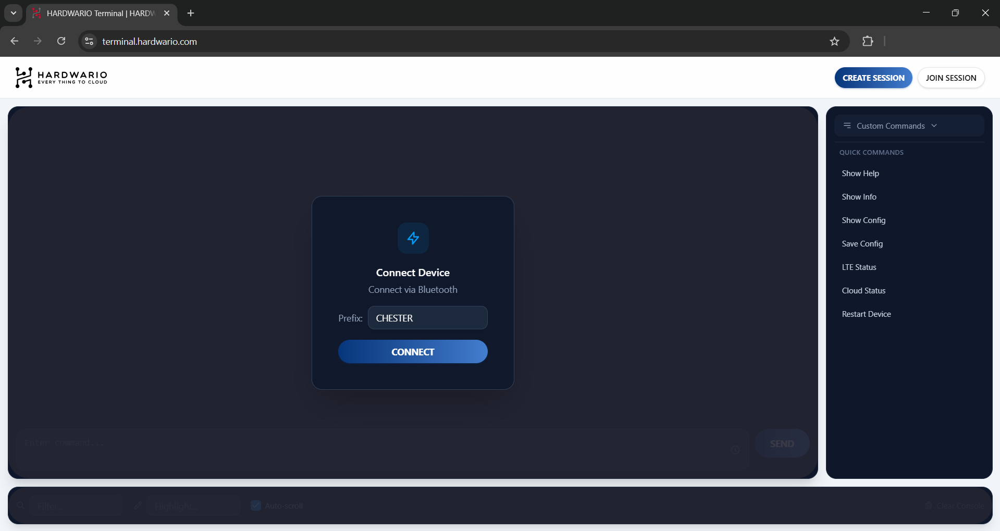
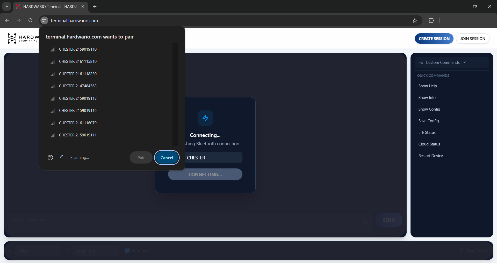
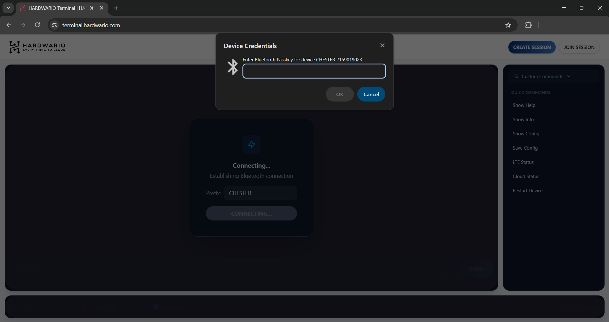
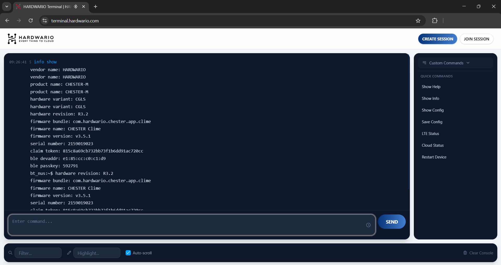
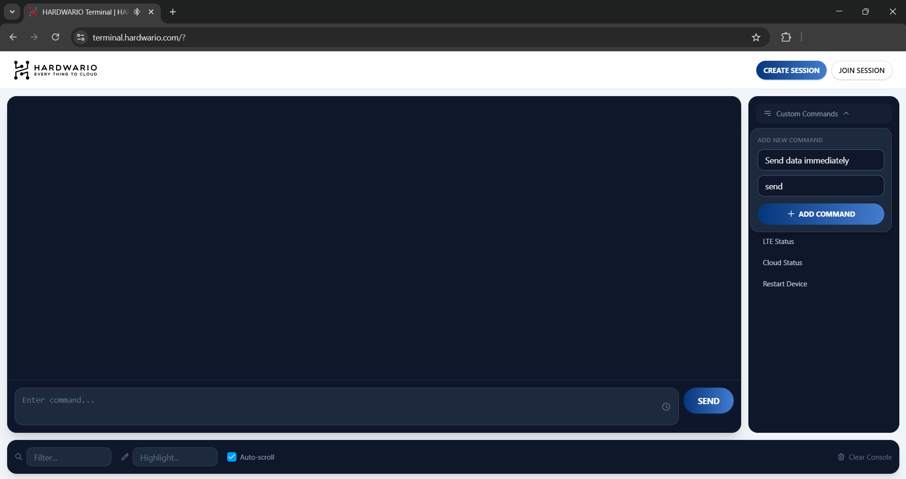
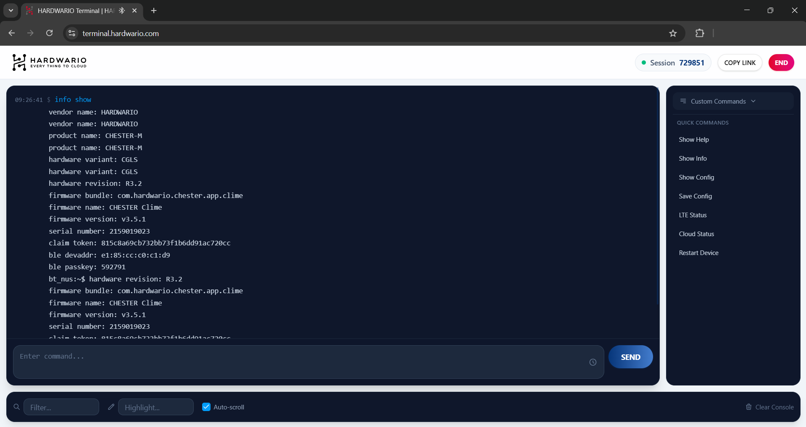
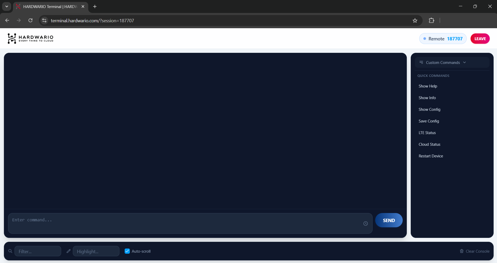

import Image from '@theme/IdealImage';

[**HARDWARIO Terminal**](https://terminal.hardwario.com/) je terminál běžící v prohlížeči Google Chrome, přes který komunikujete přímo se zařízeními a moduly HARDWARIO, a to **bez nutnosti** instalovat **další software**.

**Dostupné zde:** [**https://terminal.hardwario.com/**](https://terminal.hardwario.com/)  

:::info
**Upozornění**: HARDWARIO Terminal funguje **pouze v prohlížeči Google Chrome**.
:::

---

## Návod k aplikaci HARDWARIO Google Chrome Terminal {#hardwario-google-chrome-terminal-app-tutorial}

Tento návod vás provede používáním aplikace HARDWARIO Terminal, webového nástroje pro správu zařízení CHESTER přímo z prohlížeče Google Chrome.

---

## 1. Připojení zařízení CHESTER {#1-connecting-chester}

Nejprve propojte počítač se zařízením CHESTER přes Bluetooth.

* **Krok 1:** Otevřete Google Chrome a přejděte na **[https://terminal.hardwario.com/](https://terminal.hardwario.com/)**.
* **Krok 2:** Klikněte na tlačítko **Connect** ve středu obrazovky.

* **Krok 3:** Prohlížeč otevře okno se seznamem dostupných zařízení Bluetooth v okolí. Seznam se automaticky filtruje podle předpony `CHESTER`, takže uvidíte jen kompatibilní zařízení CHESTER.
* **Krok 4:** Vyberte ze seznamu své zařízení a klikněte na **Pair**.

* **Krok 5:** Aplikace vás vyzve k zadání **Bluetooth Passkey**. 
    * *Poznámka k passkey:* Passkey zjistíte naskenováním QR kódu na zadní straně zařízení CHESTER, nebo příkazem `info show` v terminálu (v mobilní aplikaci HARDWARIO Manager, v počítačové aplikaci HARDWARIO Monitor nebo v předchozí relaci tohoto webového terminálu).
* **Krok 6:** Zadejte passkey. Aplikace si ho zapamatuje pro další relace, takže ho pro toto zařízení už nebudete muset zadávat.

* **Krok 7:** Po úspěšném ověření se otevře rozhraní terminálu a můžete začít psát příkazy.

---

## 2. Rychlé příkazy {#2-quick-commands}

Na pravé straně rozhraní je panel **rychlých příkazů** (Quick Commands). Obsahuje nejčastěji používané příkazy zařízení CHESTER, které odešlete jedním kliknutím, místo abyste je vypisovali do terminálu. Zařízení tak ovládáte mnohem rychleji a snadněji.

Přehled výchozích rychlých příkazů:

* **Show Help:** Spustí příkaz `help`, který vypíše všechny dostupné příkazy terminálu a jejich základní syntaxi.
* **Show Info:** Spustí příkaz `info show`, který zobrazí klíčové informace o zařízení včetně verze firmwaru, sériového čísla, revize hardwaru a aktuálního napětí baterie.
* **Show Config:** Spustí příkaz `config show`, který vypíše aktuální konfigurační parametry zařízení CHESTER, takže si můžete ověřit současné nastavení.
* **Save Config:** Spustí příkaz `config save`, který zapíše všechny neuložené změny konfigurace do nevolatilní paměti zařízení, aby po restartu zůstaly zachované.
* **LTE Status:** Spustí příkaz, který zobrazí aktuální stav připojení k síti LTE včetně síly signálu (RSRP/RSRQ), operátora a stavu spojení.
* **Cloud Status:** Spustí příkaz, který zkontroluje stav spojení mezi zařízením a službami HARDWARIO Cloud.
* **Restart Device:** Spustí příkaz pro restart a bezpečně restartuje zařízení CHESTER.

---

## 3. Vlastní rychlé příkazy {#3-custom-quick-commands}

Pro akce, které děláte často, si v terminálu můžete vytvořit vlastní rychlé příkazy.

* **Krok 1:** V pravém panelu rychlých příkazů najděte nahoře nástrojovou lištu.
* **Krok 2:** Klikněte na tlačítko pro přidání nového vlastního příkazu.
* **Krok 3:** Zadejte **Label** (název, který se zobrazí na tlačítku).
* **Krok 4:** Zadejte přesný **Command**, který se má po kliknutí na tlačítko spustit. 
    * *Tip:* Pokud si nejste jistí přesnou syntaxí příkazu, napište v hlavním okně terminálu `help` a zobrazí se všechny dostupné systémové příkazy.
* **Krok 5:** Nový příkaz uložte. Objeví se v seznamu rychlých příkazů.

---

## 4. Vzdálená relace {#4-remote-session}

Velkou výhodou aplikace HARDWARIO Terminal je funkce **Remote Session** (vzdálená relace). Díky ní můžete zpřístupnit své zařízení někomu na dálku (například podpoře HARDWARIO), aniž by se k němu musel připojit přes Bluetooth. Přes Bluetooth musíte být fyzicky připojeni jen vy; pak sdílíte Session ID a druhá strana může zařízení CHESTER ovládat na dálku.

### Vytvoření relace (povolení vzdáleného přístupu) {#creating-a-session-allowing-remote-access}
* **Krok 1:** Klikněte na tlačítko **Create Session** v pravém horním rohu rozhraní terminálu.
* **Krok 2:** Relace se vytvoří okamžitě. 
* **Krok 3:** Sdílejte vygenerované **Session ID** s osobou, které chcete poskytnout přístup. Tlačítkem **Copy Link** jí můžete poslat i přímý odkaz.
* **Krok 4:** Vzdálené spojení kdykoli ukončíte tlačítkem **End**.

### Připojení k relaci (vzdálené připojení) {#joining-a-session-connecting-remotely}
* **Krok 1:** Klikněte na tlačítko **Join Session** v pravém horním rohu.
* **Krok 2:** Zadejte **Session ID**, které vám poskytl uživatel fyzicky připojený k zařízení přes Bluetooth.
* **Krok 3:** Po úspěšném připojení můžete zařízení ovládat na dálku. Výstup terminálu je synchronizovaný, takže vy i hostující uživatel vidíte všechny provedené příkazy a jejich odpovědi v reálném čase.
* **Krok 4:** Chcete-li se odpojit od vzdálené relace, klikněte na tlačítko **Leave** v pravém horním rohu.

