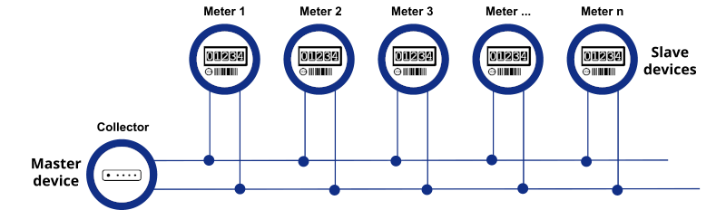

import Image from '@theme/IdealImage';

Tato stránka shrnuje rozhraní M-Bus a koncepty konfigurace používané
se zařízením CHESTER.


## Přehled komunikace M-Bus (Meter-Bus) {#m-bus-meter-bus-communication-overview}



*Obrázek: Příklad topologie M-Bus s masterem a několika slave měřiči připojenými přes dvouvodičovou sběrnici.*

## Co je M-Bus? {#what-is-m-bus}

M-Bus (Meter-Bus) je evropská norma (EN 13757) pro vzdálené odečty měřičů spotřeby a senzorů, jako jsou měřiče tepla, vodoměry, plynoměry a elektroměry. Byla navržena tak, aby umožnila komunikaci po dvouvodičové sběrnici s více slave zařízeními (měřiči) připojenými k jednomu masteru (typicky brána nebo datový koncentrátor).

M-Bus se běžně používá v systémech automatizace budov a inteligentního měření, kde poskytuje spolehlivý a nákladově efektivní způsob sběru dat z distribuované sítě měřicích zařízení.

---

## Hardwarové požadavky {#hardware-requirements}

### Topologie sběrnice {#bus-topology}
- **Dvouvodičová sběrnice** (bez polarity)
- Podporuje velké délky kabelů (až 350 metrů v závislosti na přenosové rychlosti a typu kabelu)

### Napětí a napájení {#voltage-and-power}
- **Nominální napětí sběrnice**: 24 V DC
- **Typický proudový odběr jednoho slave zařízení**: ~1,5 mA
- Master musí zajistit dostatečné napájení pro všechna připojená zařízení
- Některé M-Bus mastery zvládnou až 250 slave zařízení v závislosti na energetickém rozpočtu a kapacitě budiče

### Komponenty {#components}
- **M-Bus master**: Iniciuje komunikaci a napájí sběrnici
- **M-Bus slave zařízení**: Koncová zařízení jako měřiče a senzory
- **Převodník úrovní / transceiver**: Volitelné rozhraní mezi UART a fyzickou vrstvou M-Bus (používá se v některých embedded systémech)

---

## Formát dat {#data-format}

Komunikace M-Bus je definována ve vrstvách:

- **Fyzická vrstva**: Definuje modulaci signálu, napěťové úrovně a kabeláž
- **Linková vrstva**: Definuje adresování, formáty rámců a detekci chyb
- **Aplikační vrstva (EN 13757-3)**: Definuje strukturu a kódování dat

### Struktura zprávy {#message-structure}
Zprávy M-Bus se skládají z:
- Start byte
- Řídicí pole
- Adresní pole
- Pole řídicích informací
- Uživatelská data (telegramy)
- Kontrolní součet
- Stop byte

### Kódování dat {#data-encoding}
Hodnoty dat se přenášejí v binárním formátu pomocí deskriptorů VIF (Value Information Field) a DIF (Data Information Field). Ty určují typ, jednotku a rozsah měření.

Příklad:
- DIF = Energie  
- VIF = kilowatthodiny (kWh)  
- Hodnota = `00071F` (hex) → 182,3 kWh

### Příklad výstupu (parsované JSON) {#example-output-parsed-json}
```json
{
  "device_id": "MBUS-12345678",
  "timestamp": "2025-04-29T08:00:00Z",
  "energy_kwh": 182.3,
  "volume_m3": 12.01,
  "temperature_c": 55.2,
  "signal_strength_dbm": -72
}
```

---

## Použití {#applications}

M-Bus se používá především v:

- **Inteligentním měření** pro utility (plyn, voda, teplo, elektřina)
- **Automatizaci budov** pro HVAC, osvětlení a monitoring energetické účinnosti
- **Průmyslovém monitoringu** senzorů a aktuátorů s nízkou spotřebou
- **Systémech sběru dat** ve správě budov a infrastruktury

---

## Výhody M-Bus {#advantages-of-m-bus}

- Nízká spotřeba a nízké náklady
- Velké délky kabelů s vysokou odolností proti rušení
- Podpora velkého počtu zařízení na jedné sběrnici
- Standardizované a široce rozšířené

---

## Omezení {#limitations}

- Nízké přenosové rychlosti (typicky 300 až 9600 bps)
- Bez nativního šifrování nebo autentizace
- Vyžaduje fyzickou kabeláž
