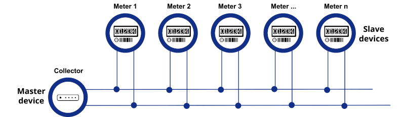

import Image from '@theme/IdealImage';

Tato stránka stručně popisuje rozhraní M-Bus a pojmy, se kterými se setkáte
při jeho konfiguraci v zařízení CHESTER.


## Přehled komunikace M-Bus (Meter-Bus) {#m-bus-meter-bus-communication-overview}



*Obrázek: Příklad topologie M-Bus s jedním masterem a několika podřízenými měřiči (slave) na dvouvodičové sběrnici.*

## Co je M-Bus? {#what-is-m-bus}

M-Bus (Meter-Bus) je evropská norma (EN 13757) pro dálkový odečet měřičů spotřeby a senzorů, například měřičů tepla, vodoměrů, plynoměrů a elektroměrů. Komunikace probíhá po dvouvodičové sběrnici, na které je k jednomu masteru (obvykle bráně nebo datovému koncentrátoru) připojeno více podřízených zařízení (slave), tedy měřičů.

M-Bus je běžný v automatizaci budov a v systémech chytrého měření, kde spolehlivě a s nízkými náklady sbírá data z mnoha rozmístěných měřidel.

---

## Hardwarové požadavky {#hardware-requirements}

### Topologie sběrnice {#bus-topology}
- **Dvouvodičová sběrnice** (bez polarity)
- Dlouhé kabelové trasy (až 350 metrů podle přenosové rychlosti a typu kabelu)

### Napětí a napájení {#voltage-and-power}
- **Jmenovité napětí sběrnice**: 24 V DC
- **Typický odběr jednoho podřízeného zařízení**: ~1,5 mA
- Master musí mít dost výkonu, aby napájel všechna připojená zařízení
- Některé mastery M-Bus obslouží až 250 podřízených zařízení, podle dostupného výkonu a kapacity budiče

### Komponenty {#components}
- **Master M-Bus**: Zahajuje komunikaci a napájí sběrnici
- **Podřízená zařízení M-Bus (slave)**: Koncová zařízení, například měřiče a senzory
- **Převodník úrovní / transceiver**: Volitelné rozhraní mezi UART a fyzickou vrstvou M-Bus (používá se v některých vestavěných systémech)

---

## Formát dat {#data-format}

Komunikaci M-Bus definuje několik vrstev:

- **Fyzická vrstva**: Definuje modulaci signálu, napěťové úrovně a kabeláž
- **Linková vrstva**: Definuje adresování, formáty rámců a detekci chyb
- **Aplikační vrstva (EN 13757-3)**: Definuje strukturu a kódování dat

### Struktura zprávy {#message-structure}
Zpráva M-Bus se skládá z těchto částí:
- Počáteční bajt (start)
- Řídicí pole
- Adresní pole
- Pole řídicích informací
- Uživatelská data (telegramy)
- Kontrolní součet
- Koncový bajt (stop)

### Kódování dat {#data-encoding}
Hodnoty se přenášejí binárně a popisují je deskriptory VIF (Value Information Field) a DIF (Data Information Field), které určují typ, jednotku a měřítko měřené hodnoty.

Příklad:
- DIF = Energie  
- VIF = kilowatthodiny (kWh)  
- Hodnota = `00071F` (hex) → 182,3 kWh

### Příklad výstupu (zpracovaný JSON) {#example-output-parsed-json}
```json
{
  "device_id": "MBUS-12345678",
  "timestamp": "2025-04-29T08:00:00Z",
  "energy_kwh": 182.3,
  "volume_m3": 12.01,
  "temperature_c": 55.2,
  "signal_strength_dbm": -72
}
```

---

## Použití {#applications}

M-Bus se používá hlavně v těchto oblastech:

- **Chytré měření** energií a médií (plyn, voda, teplo, elektřina)
- **Automatizace budov**: vytápění, větrání a klimatizace (HVAC), osvětlení a sledování energetické účinnosti
- **Průmyslový monitoring** senzorů a akčních členů s nízkou spotřebou
- **Systémy sběru dat** ve správě budov a infrastruktury

---

## Výhody M-Bus {#advantages-of-m-bus}

- Nízká spotřeba a nízké náklady
- Dlouhé kabely a vysoká odolnost proti rušení
- Podpora velkého počtu zařízení na jedné sběrnici
- Standardizovaný a široce rozšířený protokol

---

## Omezení {#limitations}

- Nízká přenosová rychlost (obvykle 300 až 9600 bps)
- Žádné vestavěné šifrování ani autentizace
- Vyžaduje kabelové propojení
