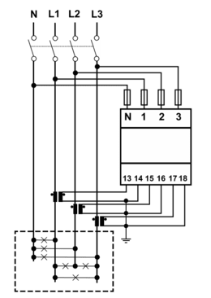
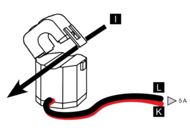
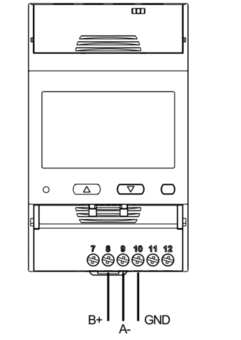

import Image from '@theme/IdealImage';


[Webové stránky](https://www.gavazziautomation.com/en-global/product/EM530DINAV53XS1PFB)

<div class="container">
  <div class="row">
    <div class="col col--8">
      <div style={{ width: '376px', height: '376px' }}>
        <Image img={require('../../../../../../chester/supported-devices/modbus/images/carlo-gavazzi-em5xx.png')} alt="Analyzátor energie Carlo Gavazzi EM530 na DIN lištu s LCD zobrazujícím hodnoty energie a výkonu" />
      </div>
    </div>
    <div class="col col--24"></div>
  </div>
</div>
<br />


### Popis {#description}

Řada EM5xx zahrnuje kompaktní a univerzální analyzátory energie, které sledují spotřebu a kvalitu elektrické energie v **jednofázových**, **dvoufázových** i **třífázových soustavách**. Hodí se do domácností, komerčních objektů i průmyslu, všude tam, kde záleží na přesném měření, spolehlivosti a snadné obsluze.

:::info

Tento elektroměr **vyžaduje** k měření proudu **externí senzor**, například proudový transformátor (CT). Senzor vyberte podle očekávané zátěže a konfigurace soustavy.

:::

 ---

### Silové zapojení {#power-installation}

#### Příklad zapojení: analyzátor energie Carlo Gavazzi EM530 {#example-of-installation-carlo-gavazzi-energy-analyzer-em530}

| **Analyzátor energie Carlo Gavazzi EM530** | |
|----------------------------------------|-----------------------------------------------|
| Pin N                                 | **N**                                         |
| Pin 1                                 | **L1**                                         |
| Pin 2                                 | **L2**                                         |
| Pin 3                                 | **L3**                                         |

:::info

 Analyzátor lze zapojit i jednofázově: nulový vodič (N) připojte na svorku N a fázi (L) na svorku 1.

:::

#### Schéma zapojení (EM530) {#connection-diagram-em530}



 ---
### Zapojení senzoru {#sensor-installation}

#### Příklad zapojení: rozevírací proudový transformátor CTA6X200A5A {#example-of-installation-split-core-current-transformer-cta6x200a5a}


| **Analyzátor energie Carlo Gavazzi EM530** | **Rozevírací proudový transformátor CTA6X200A5A** |
|----------------------------------------|-----------------------------------------------|
| Pin 13                                 | **K**                                         |
| Pin 14                                 | **L**                                         |


#### Schéma zapojení (CTA6X200A5A) {#connection-diagram-cta6x200a5a}



---

### Komunikace Modbus {#modbus-communication}

#### Příklad zapojení komunikace Modbus: analyzátor energie Carlo Gavazzi EM530 {#example-of-modbus-communication-installation-carlo-gavazzi-energy-analyzer-em530}

| **Analyzátor energie Carlo Gavazzi EM530** | **CHESTER Modbus** |
|---------------------------|--------------------|
| Pin 9                     | Pin 6 (A−)      |
| Pin 8                     | Pin 7 (B+)        |
| Pin 10                    | Pin 1 (GND)        |

#### Komunikace Modbus (EM530) {#modbus-communication-em530}



---

### Ovládací tlačítka {#browsing-and-configuration-buttons}

* `▲` **Tlačítko nahoru**
    1. Pohyb v menu
    2. Zvýšení hodnoty

* `▼` **Tlačítko dolů**
    1. Pohyb v menu
    2. Snížení hodnoty

* `⯀` **Tlačítko Select / Enter / Menu**


---

### Konfigurace komunikace Modbus v analyzátoru energie {#modbus-communication-configuration-for-energy-analyzer}

1. Tlačítkem **Select** otevřete menu.  
2. Tlačítkem **Select** vyberte položku **Setting**.  
3. Tlačítky **nahoru/dolů** vyberte položku `r5485`.  
4. Zadejte konfigurační hodnoty podle tabulky níže.

#### Výchozí konfigurace komunikace Modbus {#default-modbus-communication-configuration}

| Adresa  | Přenosová rychlost | Parita | Stop bit |
|---------|-----------|--------|-----------|
| 1       | 9.6k      | Žádná  | 1         |

---

### Konfigurace komunikace Modbus v zařízení CHESTER {#modbus-communication-configuration-for-chester}

Parametry komunikace nastavíte v terminálu CHESTER těmito příkazy:


```
app config modbus-baud "9600"
app config modbus-addr "1"
app config modbus-parity "none"
app config modbus-stop-bits "1"
app config em-type "g2"
config save
```

---

### Konfigurace převodu CT {#ct-ratio-configuration}

1. Tlačítkem **Select** otevřete menu.  
2. Tlačítkem **Select** vyberte položku **Reset**.  
3. Tlačítky **nahoru/dolů** přejděte na položku menu **MID res**.  
4. Stiskněte **Start**.  
5. Zadejte hodnoty převodu CT.  
6. Tlačítkem **nahoru** zvolte **YES** a nastavení potvrďte tlačítkem **Select**.

:::warning
Tyto modely jsou **elektroměry certifikované podle MID** (Measuring Instruments Directive, směrnice EU o měřidlech).  
Převod CT lze změnit **jen do doby**, než zařízení naměří **1 kWh** činné energie.  
Po překročení 1 kWh se převod CT **trvale uzamkne** a **nelze ho změnit** ani obnovením továrního nastavení nebo resetem MID.  
:::

### Příklad volby převodu CT {#example-of-ct-ratio-selection}

**Rozevírací proudový transformátor Carlo Gavazzi CTA6X200A5A**

| Model       | Převod CT         |
|-------------|-------------------|
| CTA6X200A5A | 40 *(200:5 → 40)* |

:::info

 Převod CT volte podle nejvyššího očekávaného primárního proudu. Je-li například maximální proud soustavy kolem 200 A, použijte CT 200:5 (převod 40), který proud pro měřicí přístroje sníží na 5 A.

:::

### Měřené hodnoty {#measured-values}

| Měřená hodnota | Klíč / cesta                                 |
|----------------|----------------------------------------------|
| Proud          | E_ENERGY_METER.METER_2.CURRENT.MEASUREMENTS  |
| Napětí         | E_ENERGY_METER.METER_2.VOLTAGE.MEASUREMENTS  |
| Výkon          | E_ENERGY_METER.METER_2.POWER.MEASUREMENTS    |
| Frekvence      | E_ENERGY_METER.METER_2.FREQUENCY.MEASUREMENTS|
| Odebraná energie | E_ENERGY_METER.METER_2.ENERGY_IN.MEASUREMENTS|
| Dodaná energie | E_ENERGY_METER.METER_2.ENERGY_OUT.MEASUREMENTS|
| Napětí L1      | E_ENERGY_METER.METER_2.VOLTAGE_L1.MEASUREMENTS|
| Napětí L2      | E_ENERGY_METER.METER_2.VOLTAGE_L2.MEASUREMENTS|
| Napětí L3      | E_ENERGY_METER.METER_2.VOLTAGE_L3.MEASUREMENTS|
| Proud L1       | E_ENERGY_METER.METER_2.CURRENT_L1.MEASUREMENTS|
| Proud L2       | E_ENERGY_METER.METER_2.CURRENT_L2.MEASUREMENTS|
| Proud L3       | E_ENERGY_METER.METER_2.CURRENT_L3.MEASUREMENTS|
| Výkon L1       | E_ENERGY_METER.METER_2.POWER_L1.MEASUREMENTS |
| Výkon L2       | E_ENERGY_METER.METER_2.POWER_L2.MEASUREMENTS |
| Výkon L3       | E_ENERGY_METER.METER_2.POWER_L3.MEASUREMENTS |
---
