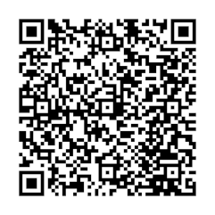

import Image from '@theme/IdealImage';

# BMeters Hydrocal M4 {#bmeters-hydrocal-m4}

[Webové stránky](https://www.bmeters.com/en/products/hydrocal-m4/)

  

    

      

        <Image img={require('../../../../../../chester/supported-devices/wm-bus/images/bmeters-hydrocal-m4.png')} width={376} height={376} alt="Měřič tepla BMeters Hydrocal M4 s LCD displejem, červenými tlačítky a mosazným tělem průtokoměru" />
      

    

    

  

 

## Popis {#description}

Kompaktní měřič tepla/BTU schopný měřit množství energie použité pro vytápění a/nebo chlazení jednotlivých odběrných míst napojených na centrální systém.

## Konfigurace {#configuration}

### Návod ke konfiguraci měřiče tepelné energie Hydrocal M4 přes NFC {#configuration-guide-for-hydrocal-m4-thermal-energy-meter-via-nfc}

Tento návod popisuje kroky konfigurace měřiče tepelné energie Hydrocal M4 pomocí smartphonu s Androidem.

---

### Krok 1: Instalace konfigurační aplikace {#step-1-install-the-configuration-app}

Stáhněte si aplikaci **B METERS NFC Config** z Google Play Store:

[https://play.google.com/store/apps/details?id=it.gread.bmeters_appnfc&hl=en](https://play.google.com/store/apps/details?id=it.gread.bmeters_appnfc&hl=en)

Naskenováním QR kódu níže přejdete přímo do aplikace:

---

### Krok 2: Připojení k měřiči {#step-2-connect-to-the-meter}

1. Zapněte na svém zařízení s Androidem **NFC**.
2. Otevřete aplikaci **B METERS NFC Config**.
3. Přiložte smartphone k NFC tagu na vodoměru, dokud se nenaváže spojení.

---

### Krok 3: Výběr typu zařízení {#step-3-select-device-type}

Ze seznamu dostupných zařízení vyberte:
- **HYDROCAL-M4**

---

### Krok 4: Konfigurace parametrů senzoru {#step-4-configure-sensor-parameters}

Nastavte následující položky:

- **AMR**: zaškrtnout (zapnout automatické odečítání měřiče)  
- **Global encryption**: zaškrtnout (použití globálního klíče místo individuálního)  
- **Ignore 5L**: stiskněte **Next** a poté vyberte **Ignore 5L** (aby vysílání začalo okamžitě)  

:::info

- Ikona M-Bus se rozsvítí, což signalizuje probíhající přípravu.  
- Aby začal přenos dat, musí blikat ikona M-Bus i symbol vysílání.  

:::

---

### Krok 5: Zápis konfigurace do měřiče {#step-5-write-configuration-to-meter}

1. Znovu přiložte telefon k NFC tagu.
2. Stiskněte tlačítko **Write**.
3. Vyčkejte na zprávu: **Writing Done**.

---

### Krok 6: Kontrola nastavení {#step-6-verify-settings}

1. Stiskněte tlačítko **Read**.
2. Zkontrolujte, že nakonfigurované hodnoty odpovídají zapsaným.

Váš vodoměr je nyní úspěšně nakonfigurován.

## Konfigurace adresy wireless M-Bus {#wireless-m-bus-address-configuration}

### Kde na zařízení najdete adresu {#where-to-find-the-address-on-the-device}

Adresa se nachází **vlevo pod čárovým kódem**, jak je vidět na obrázku níže (8 číslic).  

  

    

      

        <Image img={require('../../../../../../chester/supported-devices/wm-bus/images/bmeters-hydrocal-m4.png')} width={376} height={376} alt="Etiketa Hydrocal M4 s vyznačenou 8místnou wM-Bus adresou vlevo pod čárovým kódem" />
      

    

    

  

 

---

### Mapování wM-Bus adresy do zařízení CHESTER {#mapping-the-wm-bus-address-to-chester}

Mapování je nutné provést pomocí **CHESTER Terminal**, například s:  

- [**HARDWARIO Monitor (Windows)**](https://github.com/hardwario/hio-monitor/releases)
- [**HARDWARIO Manager (Android)**](https://play.google.com/store/apps/details?id=com.hardwario.manager)
- [**Terminál v Google Chrome**](https://terminal.hardwario.com/)

---

### Správa a přidávání adres wM-Bus zařízení v zařízení CHESTER {#managing-and-adding-wm-bus-device-addresses-in-chester}

Zde můžete spravovat seznam **wM-Bus adres** (**přidat/odebrat**), upravit nastavení skenování a prohlédnout si ukázkové konfigurace typických nasazení.  

- [**Konfigurace seznamu adres**](/chester/catalog-applications/chester-wm-bus#address-list-configuration) – **správa a editace** seznamu propojených wM-Bus **adres**  
- [**Konfigurace skenování**](/chester/catalog-applications/chester-wm-bus#scan-configuration) – **úprava nastavení skenování** pro komunikaci se zařízeními 
- [**Ukázkové konfigurace**](/chester/catalog-applications/chester-wm-bus#example-configurations) – referenční **šablony** pro typická nasazení 

---

## Šifrování zpráv a správa klíčů {#message-encryption-and-key-management}

**Přenášené zprávy jsou šifrovány** pro optimalizaci spotřeby energie při přenosu dat, což prodlužuje celkovou životnost baterie.

**Přijatá data je tedy nutné dešifrovat**, což se provádí pomocí **dešifrovacích klíčů**.  
K tomu existují dvě možnosti:

- [**HARDWARIO Cloud**](/chester/catalog-applications/chester-wm-bus#hardwario-cloud--decryption-keys) – návod, jak zadat a spravovat dešifrovací klíče  
- [**Dešifrovací stránka**](https://wmbusmeters.org/) – online nástroj pro manuální dešifrování a analýzu dat
