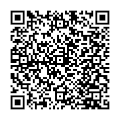

import Image from '@theme/IdealImage';

# BMeters Hydrocal M4 {#bmeters-hydrocal-m4}

[Webové stránky](https://www.bmeters.com/en/products/hydrocal-m4/)

  

    

      

        <Image img={require('../../../../../../chester/supported-devices/wm-bus/images/bmeters-hydrocal-m4.png')} width={376} height={376} alt="Měřič tepla BMeters Hydrocal M4 s LCD displejem, červenými tlačítky a mosazným tělem průtokoměru" />
      

    

    

  

 

## Popis {#description}

Hydrocal M4 je kompaktní měřič tepla (BTU), který měří energii spotřebovanou na vytápění nebo chlazení jednotlivých odběrných míst napojených na centrální systém.

## Konfigurace {#configuration}

### Konfigurace měřiče tepelné energie Hydrocal M4 přes NFC {#configuration-guide-for-hydrocal-m4-thermal-energy-meter-via-nfc}

Tento návod popisuje, jak měřič tepelné energie Hydrocal M4 nastavíte přes NFC telefonem s Androidem.

---

### Krok 1: Instalace konfigurační aplikace {#step-1-install-the-configuration-app}

Stáhněte si aplikaci **B METERS NFC Config** z obchodu Google Play:

[https://play.google.com/store/apps/details?id=it.gread.bmeters_appnfc&hl=en](https://play.google.com/store/apps/details?id=it.gread.bmeters_appnfc&hl=en)

Naskenováním QR kódu níže přejdete přímo do aplikace:

---

### Krok 2: Připojení k měřiči {#step-2-connect-to-the-meter}

1. Zapněte v telefonu s Androidem **NFC**.
2. Otevřete aplikaci **B METERS NFC Config**.
3. Přiložte telefon k NFC tagu na měřiči a držte ho tam, dokud se nenaváže spojení.

---

### Krok 3: Výběr typu zařízení {#step-3-select-device-type}

Ze seznamu dostupných zařízení vyberte:
- **HYDROCAL-M4**

---

### Krok 4: Nastavení parametrů senzoru {#step-4-configure-sensor-parameters}

Nastavte tyto položky:

- **AMR**: zaškrtnout (automatický odečet měřiče)  
- **Global encryption**: zaškrtnout (globální klíč místo individuálního)  
- **Ignore 5L**: stiskněte **Next** a vyberte **Ignore 5L** (vysílání tak začne okamžitě)  

:::info

- Rozsvícená ikona M-Bus znamená, že se vysílání připravuje.  
- Aby začal přenos dat, musí blikat ikona M-Bus i symbol vysílání.  

:::

---

### Krok 5: Zápis konfigurace do měřiče {#step-5-write-configuration-to-meter}

1. Znovu přiložte telefon k NFC tagu.
2. Klepněte na tlačítko **Write**.
3. Počkejte na hlášení **Writing Done**.

---

### Krok 6: Kontrola nastavení {#step-6-verify-settings}

1. Klepněte na tlačítko **Read**.
2. Zkontrolujte, že načtené hodnoty odpovídají zapsaným.

Měřič je teď nastavený.

## Konfigurace adresy wM-Bus {#wireless-m-bus-address-configuration}

### Kde na zařízení najdete adresu {#where-to-find-the-address-on-the-device}

Adresa (8 číslic) je **vlevo pod čárovým kódem**, viz obrázek níže.  

  

    

      

        <Image img={require('../../../../../../chester/supported-devices/wm-bus/images/bmeters-hydrocal-m4.png')} width={376} height={376} alt="Štítek měřiče Hydrocal M4 s vyznačenou osmimístnou adresou wM-Bus vlevo pod čárovým kódem" />
      

    

    

  

 

---

### Přiřazení adresy wM-Bus k zařízení CHESTER {#mapping-the-wm-bus-address-to-chester}

Adresu přiřadíte v **terminálu CHESTER**, například v těchto aplikacích:

- [**HARDWARIO Monitor (Windows)**](https://github.com/hardwario/hio-monitor/releases)
- [**HARDWARIO Manager (Android)**](https://play.google.com/store/apps/details?id=com.hardwario.manager)
- [**Terminál pro Google Chrome**](https://terminal.hardwario.com/)

---

### Přidávání a správa adres wM-Bus v zařízení CHESTER {#managing-and-adding-wm-bus-device-addresses-in-chester}

Správu seznamu **adres wM-Bus** (**přidávání a odebírání**), nastavení skenování i příklady konfigurací pro typická nasazení popisuje dokumentace aplikace CHESTER wM-Bus:

- [**Konfigurace seznamu adres**](/chester/catalog-applications/chester-wm-bus#address-list-configuration): **správa a úprava** seznamu propojených **adres** wM-Bus
- [**Konfigurace skenování**](/chester/catalog-applications/chester-wm-bus#scan-configuration): **úprava nastavení skenování** pro komunikaci se zařízeními
- [**Příklady konfigurací**](/chester/catalog-applications/chester-wm-bus#example-configurations): referenční **šablony** pro typická nasazení

---

## Šifrování zpráv a správa klíčů {#message-encryption-and-key-management}

**Odesílané zprávy jsou šifrované**, aby se při přenosu dat šetřila energie a prodloužila výdrž baterie.

**Přijatá data je proto nutné dešifrovat** pomocí **dešifrovacích klíčů**.  
Máte dvě možnosti:

- [**HARDWARIO Cloud**](/chester/catalog-applications/chester-wm-bus#hardwario-cloud--decryption-keys): návod, jak zadávat a spravovat dešifrovací klíče
- [**Dešifrovací stránka**](https://wmbusmeters.org/): online nástroj pro ruční dešifrování a analýzu dat
