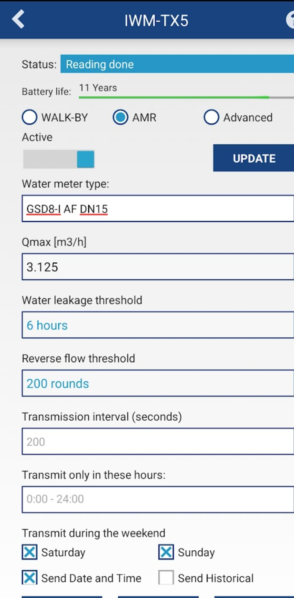

import Image from '@theme/IdealImage';

# BMeters IWM-TX3 {#bmeters-iwm-tx3}

[Webové stránky](https://www.bmeters.com/en/products/iwm-tx3/)

  

    

      

        <Image img={require('../../../../../../chester/supported-devices/wm-bus/images/bmeters-iwm-tx3.png')} width={376} height={376} alt="Bílý rádiový modul BMeters IWM-TX3 wM-Bus pro vodoměry" />
      

    

    

  

 

## Popis {#description}

IWM-TX3 je rádiový modul wM-Bus pro přenos dat o spotřebě, použitelný pro řadu vícevtokových vodoměrů mod. GMDM-I, GMB-I, GMB-RP-I a jednovtokových mod. CPR-M3-I.

## Konfigurace {#configuration}

### Průvodce konfigurací vodoměru IWM-TX3 přes NFC {#configuration-guide-for-iwm-tx3-water-meter-via-nfc}

Tento průvodce popisuje kroky ke konfiguraci vodoměru s modulem IWM-TX3 NFC pomocí chytrého telefonu s Androidem.

---

### Krok 1: Instalace konfigurační aplikace {#step-1-install-the-configuration-app}

Stáhněte si aplikaci **B METERS NFC Config** z obchodu Google Play:

[https://play.google.com/store/apps/details?id=it.gread.bmeters_appnfc&hl=en](https://play.google.com/store/apps/details?id=it.gread.bmeters_appnfc&hl=en)

Pro přechod přímo do aplikace můžete naskenovat QR kód níže:

---

### Krok 2: Připojení k vodoměru {#step-2-connect-to-the-meter}

1. Zapněte na svém zařízení s Androidem **NFC**.
2. Otevřete aplikaci **B METERS NFC Config**.
3. Přiložte telefon k NFC tagu na vodoměru a držte jej, dokud se nenaváže spojení.

---

### Krok 3: Výběr typu zařízení {#step-3-select-device-type}

Ze seznamu dostupných zařízení vyberte:

- **IWM-TX3**

---

### Krok 4: Nastavení parametrů senzoru {#step-4-configure-sensor-parameters}

Upravte následující nastavení:

- **AMR**: zaškrtnout (zapnout automatické odečty)
- **Water meter type**: `GMDM-I AF`
- **Transmit during weekend**: zaškrtnout (zapnout vysílání o víkendech)
- **Global encryption**: zaškrtnout (použití globálního klíče místo individuálního)

---

### Krok 5: Zápis konfigurace do vodoměru {#step-5-write-configuration-to-meter}

1. Znovu přiložte telefon k NFC tagu.
2. Klepněte na tlačítko **Write**.
3. Počkejte na hlášení: **Writing Done**.

---

### Krok 6: Ověření nastavení {#step-6-verify-settings}

1. Klepněte na tlačítko **Read**.
2. Zkontrolujte, že nakonfigurované hodnoty odpovídají zapsaným.

Váš vodoměr je nyní úspěšně nakonfigurován.

---

## Konfigurace adresy Wireless M-Bus {#wireless-m-bus-address-configuration}

### Kde na zařízení najdete adresu {#where-to-find-the-address-on-the-device}

Adresa je umístěna **uprostřed nad čárovým kódem**, za písmeny **SN** (sériové číslo), jak je vidět na obrázku níže (8 číslic).  

  

    

      

        <Image img={require('../../../../../../chester/supported-devices/wm-bus/images/bmeters-iwm-tx3.png')} width={376} height={376} alt="IWM-TX3 s vyznačenou osmimístnou wM-Bus adresou za SN nad čárovým kódem" />
      

    

    

  

 

---

### Přiřazení wM-Bus adresy k zařízení CHESTER {#mapping-the-wm-bus-address-to-chester}

Přiřazení se provádí pomocí terminálu **CHESTER Terminal**, například s:  

- [**HARDWARIO Monitor (Windows)**](https://github.com/hardwario/hio-monitor/releases)
- [**HARDWARIO Manager (Android)**](https://play.google.com/store/apps/details?id=com.hardwario.manager)
- [**Google Chrome Terminal**](https://terminal.hardwario.com/)

---

### Správa a přidávání adres wM-Bus zařízení v zařízení CHESTER {#managing-and-adding-wm-bus-device-addresses-in-chester}

Zde můžete spravovat seznam **wM-Bus adres** (**přidávat/odebírat**), upravovat nastavení skenování a prohlédnout si ukázkové konfigurace pro typická nasazení.  

- [**Konfigurace seznamu adres**](/chester/catalog-applications/chester-wm-bus#address-list-configuration): **správa a úprava** seznamu propojených wM-Bus **adres**  
- [**Konfigurace skenování**](/chester/catalog-applications/chester-wm-bus#scan-configuration): **úprava nastavení skenování** pro komunikaci se zařízeními 
- [**Ukázkové konfigurace**](/chester/catalog-applications/chester-wm-bus#example-configurations): referenční **šablony** pro typická nasazení 

---

## Šifrování zpráv a správa klíčů {#message-encryption-and-key-management}

**Přenášené zprávy jsou šifrovány**, aby se optimalizovala spotřeba energie při přenosu dat, což prodlužuje celkovou výdrž baterie.

**Přijatá data je proto nutné dešifrovat**, což se provádí pomocí **dešifrovacích klíčů**.  
K tomu jsou dvě možnosti:

- [**HARDWARIO Cloud**](/chester/catalog-applications/chester-wm-bus#hardwario-cloud--decryption-keys): návod, jak zadávat a spravovat dešifrovací klíče  
- [**Dešifrovací stránka**](https://wmbusmeters.org/): online nástroj pro ruční dešifrování a analýzu dat
