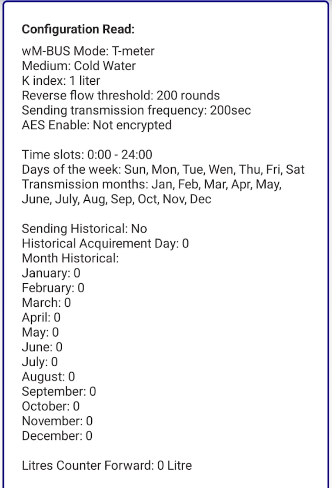

import Image from '@theme/IdealImage';

# BMeters IWM-TX5 {#bmeters-iwm-tx5}

[Webové stránky](https://www.bmeters.com/en/products/iwm-tx5/)

  

    

      

        <Image img={require('../../../../../../chester/supported-devices/wm-bus/images/bmeters-iwm-tx5.png')} width={376} height={376} alt="Bílý rádiový modul BMeters IWM-TX5 wM-Bus se štítkem s čárovým kódem a značkou NFC" />
      

    

    

  

 

## Popis {#description}

IWM-TX5 je rádiový modul vhodný pro přenos dat o spotřebě a použitelný pro jednovtokové vodoměry GSD8-I.

## Konfigurace {#configuration}

### Průvodce konfigurací vodoměru IWM-TX5 pomocí NFC {#configuration-guide-for-iwm-tx5-water-meter-via-nfc}

Tento průvodce popisuje kroky pro konfiguraci vodoměru s modulem NFC IWM-TX5 pomocí telefonu s Androidem.

---

### Krok 1: Instalace konfigurační aplikace {#step-1-install-the-configuration-app}

Stáhněte si aplikaci **B METERS NFC Config** z Google Play Store:

[https://play.google.com/store/apps/details?id=it.gread.bmeters_appnfc&hl=en](https://play.google.com/store/apps/details?id=it.gread.bmeters_appnfc&hl=en)

Naskenováním QR kódu níže přejdete přímo do aplikace:

---

### Krok 2: Připojení k vodoměru {#step-2-connect-to-the-meter}

1. Zapněte na svém zařízení s Androidem **NFC**.
2. Otevřete aplikaci **B METERS NFC Config**.
3. Přiložte telefon k NFC tagu na vodoměru a držte jej, dokud nedojde k navázání spojení.

---

### Krok 3: Výběr typu zařízení {#step-3-select-device-type}

Ze seznamu dostupných zařízení vyberte:
- **IWM-TX5**

---

### Krok 4: Konfigurace parametrů senzoru {#step-4-configure-sensor-parameters}

Upravte následující nastavení:

- **AMR**: zaškrtnout (zapnout automatické odečítání měřiče)
- **Water meter type**: `GSD8-I AF DN15`
- **Transmit during weekend**: zaškrtnout „Saturday" a „Sunday" a „Send Date and Time"
- **Global encryption**: zaškrtnout (použití globálního klíče místo individuálního)

---

### Krok 5: Zápis konfigurace do vodoměru {#step-5-write-configuration-to-meter}

1. Znovu přiložte telefon k NFC tagu.
2. Klepněte na tlačítko **Write**.
3. Vyčkejte na zprávu: **Writing Done**.

---

### Krok 6: Kontrola nastavení {#step-6-verify-settings}

1. Klepněte na tlačítko **Read**.
2. Zkontrolujte, že nakonfigurované hodnoty odpovídají tomu, co bylo zapsáno.

Váš vodoměr je nyní úspěšně nakonfigurován.

## Konfigurace adresy Wireless M-Bus {#wireless-m-bus-address-configuration}

### Kde na zařízení najdete adresu {#where-to-find-the-address-on-the-device}

Adresa je umístěna **ve středu pod čárovým kódem**, za **značkou CE**, jak je vidět na obrázku níže (8 číslic).  

  

    

      

        <Image img={require('../../../../../../chester/supported-devices/wm-bus/images/bmeters-iwm-tx5.png')} width={376} height={376} alt="IWM-TX5 s vyznačenou 8místnou wM-Bus adresou pod čárovým kódem za značkou CE" />
      

    

    

  

 

---

### Přiřazení wM-Bus adresy k zařízení CHESTER {#mapping-the-wm-bus-address-to-chester}

Přiřazení je nutné provést pomocí **terminálu CHESTER**, například s:  

- [**HARDWARIO Monitor (Windows)**](https://github.com/hardwario/hio-monitor/releases)
- [**HARDWARIO Manager (Android)**](https://play.google.com/store/apps/details?id=com.hardwario.manager)
- [**Terminál v Google Chrome**](https://terminal.hardwario.com/)

---

### Správa a přidávání adres wM-Bus zařízení v zařízení CHESTER {#managing-and-adding-wm-bus-device-addresses-in-chester}

Zde můžete spravovat seznam **wM-Bus adres** (**přidat/odebrat**), upravit nastavení skenování a projít si ukázkové konfigurace pro typická nasazení.  

- [**Konfigurace seznamu adres**](/chester/catalog-applications/chester-wm-bus#address-list-configuration) – **správa a úprava** seznamu propojených wM-Bus **adres**  
- [**Konfigurace skenování**](/chester/catalog-applications/chester-wm-bus#scan-configuration) – **úprava nastavení skenování** pro komunikaci se zařízeními 
- [**Ukázkové konfigurace**](/chester/catalog-applications/chester-wm-bus#example-configurations) – referenční **šablony** pro typická nasazení 

---

## Šifrování zpráv a správa klíčů {#message-encryption-and-key-management}

**Přenášené zprávy jsou šifrované**, aby se optimalizovala spotřeba energie během přenosu dat, což prodlužuje celkovou životnost baterie.

**Přijatá data je proto nutné dešifrovat**, což se provádí pomocí **dešifrovacích klíčů**.  
K tomu existují dvě možnosti:

- [**HARDWARIO Cloud**](/chester/catalog-applications/chester-wm-bus#hardwario-cloud--decryption-keys) – návod, jak zadávat a spravovat dešifrovací klíče  
- [**Dešifrovací stránka**](https://wmbusmeters.org/) – online nástroj pro manuální dešifrování a analýzu dat
