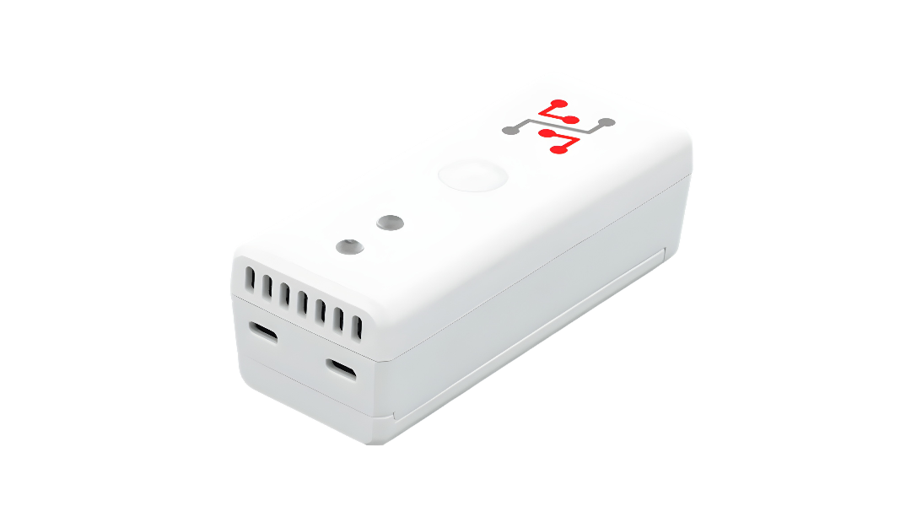

import Image from '@theme/IdealImage';

# Hardware Description

STICKER is a compact IoT device built on the **STM32WL System-on-Chip** with an integrated **LoRa radio** and ARM Cortex-M4F core.  
It is powered by two AA batteries, with battery voltage monitoring and efficient power management (boost converter and LDO).

The device includes **NFC memory and antenna** for simple configuration, even without power (energy harvesting).

It features a rich set of **built-in sensors**:
- Temperature and humidity (SHT43)  
- Light intensity (OPT3001)  
- Atmospheric pressure (MPL3115A2)  
- PIR motion (PYD1698)  
- 3-axis accelerometer (LIS2DH12)  
- Dual Hall-effect door opening detector (A1266)  

For flexibility, there is also:
- **1-Wire bus master** for external sensors  
- **Terminal block for external inputs**  

Device status is indicated by a **multi-color LED (R/G/Y)** and communication is handled via an **internal 868/915 MHz antenna**.

---

## Block Diagram

  

    

      

        <Image img={require('./images/block-diagram-sticker.png')} />
      

    

    

    

  

 

---

### NFC Configuration Architecture

---

## Overview

#### Sticker Clime - Enclosure, Mainboard, and Battery Holder

#### Sticker Input - Enclosure, Mainboard, and Battery Holder

#### Sticker Motion - Enclosure, Mainboard, and Battery Holder

---

## Hardware Schematics

### Power

**[Download Power Schematic (PDF)](hardware-diagrams/power.pdf)**

### Antenna

**[Download Antenna Schematic (PDF)](hardware-diagrams/antenna.pdf)**

### MCU

**[Download MCU Schematic (PDF)](hardware-diagrams/mcu.pdf)**

### Sensors

**[Download Sensors Schematic (PDF)](hardware-diagrams/sensors.pdf)**

### NFC

**[Download NFC Schematic (PDF)](hardware-diagrams/nfc.pdf)**

---

## Technical Specification

| **Category** | **Parameter** | **Value** |
|-------------------|---------------------------|------------------------------------|
| **Structure** | Enclosure material        | ABS                                |
|                   | Dimension                 | 91 × 36.5 × 33.3 mm                |
| **Power** | Nominal cell voltage      | 1.5 V                              |
|                   | Nominal battery capacity  | 3000 mAh                           |
|                   | Operating voltage range   | 1.8 V to 3.6 V                     |
|                   | Idle power consumption    | < 80 µA                            |
|                   | Peak power consumption    | < 100 mA                           |
| **Environment** | Operating temperature     | -30 °C to +70 °C                   |
|                   | Storage temperature       | -40 °C to +85 °C                   |
|                   | Enclosure protection      | IP40                               |
| **Sensors** | Integrated thermometer – Measurement range   | -20 °C to +60 °C     |
|                   | Integrated thermometer – Measurement accuracy| ±0.2 °C (0 °C to 65 °C) |
|                   | Integrated hygrometer – Measurement range    | 0 % to 100 %           |
|                   | Integrated hygrometer – Measurement accuracy | ±2 % (from 10 % to 90 %) |
|                   | PIR – Detection range     | 5 m                                |
|                   | PIR – Viewing angle       | ≥ 50°                              |

